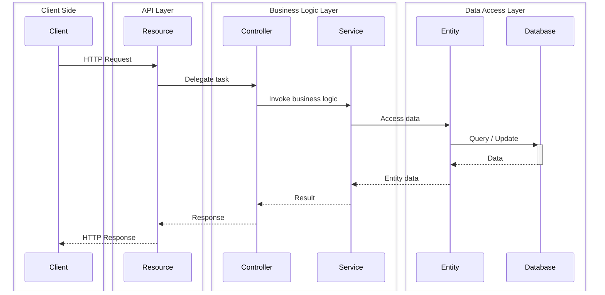
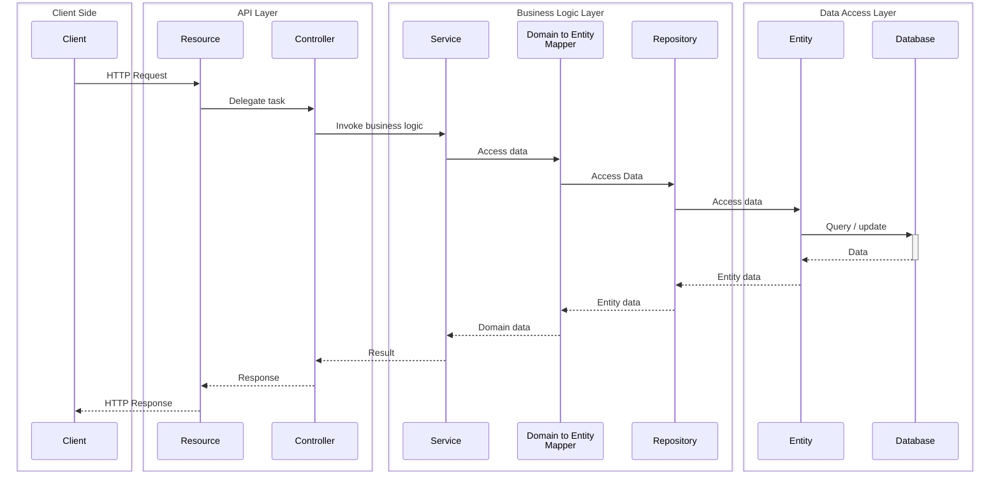

# Complex System and DevOps project report

## Table of Contents

- [Complex System and DevOps project report](#complex-system-and-devops-project-report)
  - [Table of Contents](#table-of-contents)
  - [Introduction](#introduction)
    - [Background](#background)
    - [Purpose](#purpose)
    - [Scope](#scope)
  - [Analysis](#analysis)
    - [Requirements](#requirements)
    - [Challenges](#challenges)
  - [Design](#design)
    - [Architecture](#architecture)
    - [Design Decisions](#design-decisions)
  - [Implementation](#implementation)
    - [Technologies Used](#technologies-used)
    - [Code Structure](#code-structure)
  - [Test](#test)
    - [Test Plan](#test-plan)
    - [Results](#results)
  - [Conclusion](#conclusion)
    - [Summary](#summary)
    - [Future Work](#future-work)

---

## Introduction

### Background
[Brief overview of the project background.]

### Purpose
[State the purpose of the project.]

### Scope
[Define the scope of the document or project.]

## Analysis

### Requirements
[List the functional and non-functional requirements.]

### Challenges
[Highlight the challenges encountered during analysis.]

## Design

### Architecture
[Overview of the system architecture.]

#### Backend
The backend of our system prioritizes modularity, scalability, and a clear separation of concerns. At its core, the architecture follows a layered pattern, which enhances maintainability and allows for seamless expansion as the system evolves.

The backbone of our backend is composed of three primary components that work together to process requests and manage data. **Resources** serve as the initial touchpoints, handling incoming HTTP requests and defining the API endpoints that external systems interact with. These resources then delegate tasks to **Controllers**, which act as intermediaries in the architectural flow. Controllers bridge the gap between the external-facing resources and the internal business logic, facilitating the transition of data and operations.

The core of the system consists of **Services**, encapsulating business logic and domain-specific operations. This layered approach creates a clear, hierarchical flow of information and responsibility throughout the system. When an HTTP request arrives, it's received by the Resource layer, which then delegates to the corresponding Controller. The Controller, in turn, interacts with one or more Services to execute the necessary business logic. In some cases, Services may need to communicate with other Services or directly access the data layer to fulfill their responsibilities.

A key strength of the architecture is its modular organization. Rather than structuring components by their purpose, they are organized by domain. This approach enhances scalability and maintenance, as each domain — such as authentication or user management — has its own self-contained set of resources, controllers, and services. This structure makes it easier to add new features or modules and simplifies the process of maintaining and updating existing ones.

While the current implementation uses a direct connection to the database through entity classes, the architecture is designed with future improvements in mind. We plan to introduce a repository layer, which will further abstract data access from business logic, enhancing the system's flexibility and maintainability.

While the current implementation uses a direct connection to the database through entity classes, the architecture is designed with future improvements in mind. We plan to introduce a repository layer and domain-to-database model mappers. The repository layer will further abstract data access from business logic, while the mappers will provide a clear separation between database representations and domain models. These additions will enhance the system's flexibility, maintainability, and adherence to clean architecture principles.

Security is an important concern in the system, and a robust authentication mechanism has been implemented to address this. By utilizing access tokens as JWTs and refresh tokens as UUIDs, the system provides both security and a good user experience. The limited lifespan of access tokens enhances security, while the revocable refresh tokens allows for better control over user sessions compared to using non-revocable JWTs alone.

In the future, we've identified areas for further improvement. The introduction of a repository layer will further abstract data access from business logic, while the implementation of a domain model to database model mapper will create a clear separation between how entities are represented in the database and how they're used in business logic. These improvements will enhance the system's modularity and maintainability.

The following is a sequence diagram of the layered architecture.

The next diagram shows our planned domain–database repository abstraction

### Design Decisions
[Discuss key design decisions and their rationale.]

## Implementation

### Technologies Used
[List the technologies and tools used.]

### Code Structure
[Provide an overview of the code organization and structure.]

## Test

### Test Plan
[Describe the testing approach and methodologies.]

### Results
[Summarize the test results and key findings.]

## Conclusion

### Summary
[Summarize the main points of the project.]

### Future Work
[Mention any potential future improvements or follow-up work.]
