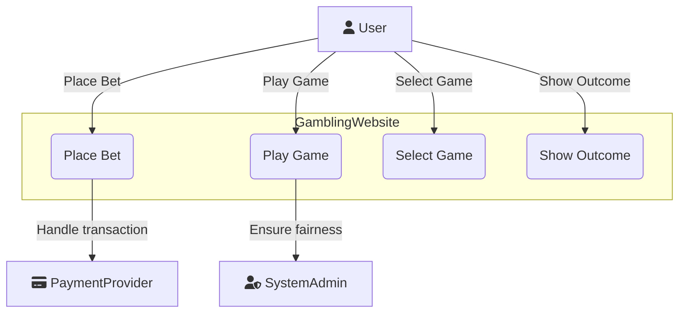

# Complex System and DevOps project report

## Table of Contents

- [Complex System and DevOps project report](#complex-system-and-devops-project-report)
  - [Table of Contents](#table-of-contents)
  - [Introduction](#introduction)
    - [Background](#background)
    - [Purpose](#purpose)
    - [Scope](#scope)
  - [Analysis](#analysis)
    - [Requirements](#requirements)
- [Use Cases \& Stories](#use-cases--stories)
- [Our Use Case \& User Stories](#our-use-case--user-stories)
  - [Main – UC 1.1. Diagram](#main--uc-11-diagram)
  - [US 1.1](#us-11)
    - [UC 1.1: Game Selection \& Play](#uc-11-game-selection--play)
      - [Use Case Section Description](#use-case-section-description)
      - [Stakeholders \& Interest](#stakeholders--interest)
      - [Main Success Scenario](#main-success-scenario)
      - [Extensions](#extensions)
    - [US 1.2](#us-12)
      - [UC 1.2: Game Outcome Processing](#uc-12-game-outcome-processing)
  - [Standalone Use Cases](#standalone-use-cases)
    - [UC 1.3: Betting Mechanics](#uc-13-betting-mechanics)
    - [UC 1.4: Backend Game Hosting](#uc-14-backend-game-hosting)
    - [Challenges](#challenges)
  - [Design](#design)
    - [Architecture](#architecture)
    - [Design Decisions](#design-decisions)
  - [Implementation](#implementation)
    - [Technologies Used](#technologies-used)
    - [Code Structure](#code-structure)
  - [Test](#test)
    - [Test Plan](#test-plan)
    - [Results](#results)
  - [Conclusion](#conclusion)
    - [Summary](#summary)
    - [Future Work](#future-work)

---

## Introduction

In this project the goals is to design and implement the frontend and backend for a program, and manage the program by implementing the principles of DevOps. This program will be a gambling website that will feature games like poker, roulette and coinflip. 

The frontend will be implemented using JavaScript frameworks such as React, TypeScript, and Vite, providing a satisfying user experience. The backend will be made with Java/Kotlin with Quarkus, a powerful framework for building Java applications, paired with PostgreSQL for managing the database. The backend will handle core functionality, like game logic, user authentication, and secure data management via OIDC for token-based authentication.

An important part of this project is to ensure the use of DevOps practices, to ensure that all components of the project are developed and deployed with automation and continous integration. Docker will be used for containerization, while GitHub and GitHub Actions will handle version control, automated testing, and deployment. The goal of this approach is to allow for frequent updates and efficient scaling.

This report will go through the design and implementation of the project, as well as how DevOps tools and methods has been applied currently, and how they will be used in the future. The current report is based on the work that has been done up to September 22, 2024.

### Background

[Brief overview of the project background.]

### Purpose

[State the purpose of the project.]

### Scope

[Define the scope of the document or project.]

## Analysis

### Requirements

[List the functional and non-functional requirements.]

# Use Cases & Stories

**Use Cases**
describe the interactions between a user (or another system) and the system itself to achieve a specific goal. They focus on what the system should do and define the steps involved in achieving the user's objectives, including different success and failure scenarios.

**User Stories** are short, simple descriptions of features told from the perspective of the end-user. They typically follow the format: "As a *type of user*, I want *goal* so that *benefit*." User stories help capture user needs and provide a foundation for creating detailed use cases.

# Our Use Case & User Stories

We used our user stories (US) to derive the corresponding use cases (UC). A use case diagram was created for the first use case, **"Game Selection & Play,"** to illustrate the system interactions.

## Main – UC 1.1. Diagram

The diagram shows the main interactions within the gambling website. The **User** selects games, places bets, plays, and views outcomes. The **Payment Provider** handles transactions, while the **System Admin** ensures game fairness and compliance.

## US 1.1

As a **Gambler**:

- I want an easy-to-navigate website where I can quickly access and select games, place wagers securely, and enjoy a fair gaming experience.
  
**So that:**

- I can participate in gambling activities seamlessly.

The primary use case involves enabling users to play a game and place wagers on it. Please note that elements marked as "Example" may not be included in our version of the program due to scope limitations. Subsequent use cases will include brief summaries, as the main flow has yet to be finalized for the sub use cases. All these use cases (including the main one) are **WIP** and will be subject to change.

### UC 1.1: Game Selection & Play

#### Use Case Section Description

**Name:** UC 1.1: Game selection & play

**Scope:**
- Selection of available games
- User interaction with game features
- Placing wagers
- Ensuring a fair and compliant gaming experience
- Secure transactions

**Primary actor:** User (gambler)

**Level:** cloud / level 0

#### Stakeholders & Interest

- **User:** Wants an easy-to-navigate webpage, easy access to games, and the ability to place wagers.
- **System Admin:** Needs to ensure that the games function smoothly, comply with legal regulations, and maintain fairness in wagers.
- **Payment Provider:** Interested in secure & fast transactions.

**Preconditions:**
- User must have an active account and be signed in.
- User must have sufficient funds in their account to play (free play if applicable).
- "The platform must be legal".

**Postconditions:**
- If the user wins, their account balance is updated with the winnings.
- If the user loses, the wager amount is deducted from their account balance.
- Game data, including the outcome and amount wagered, is stored in the system for auditing and regulatory purposes.
- The user has the option to leave feedback on the game or report any issues.

#### Main Success Scenario

1. **Game Lobby:**
   - User navigates to the Landing Page (home page for games).
   - The website displays a list of available games (e.g., slots, poker, blackjack, roulette) with categories like Top Games, New Releases, Jackpot Games, etc.
   - User sees options for sorting and filtering games by type, popularity, jackpot size, etc.
2. **Game Selection:**
   - User clicks on a game thumbnail to view detailed information about the game.
   - Information includes game rules, minimum/maximum bets, potential winnings, RTP (Return to Player) percentage, and a "Play Now" button.
3. **Game Loading:**
   - The system loads the selected game in the browser, initializing game assets and connecting to the game server if needed.
   - A loading screen shows the game logo or promotional visuals while waiting.
4. **Bet Placement:**
   - The user is presented with betting options (e.g., stake size for a slot machine, bet type for blackjack).
   - The user chooses the amount they want to wager and confirms the bet.
   - If applicable, the system checks the user’s available balance to ensure they have enough funds.
5. **Game Play:**
   - The game begins. For example:
     - **Slots:** User clicks "Spin" and watches the reels turn.
     - **Blackjack:** User receives virtual cards and makes decisions (hit, stand, etc.).
     - **Roulette:** User places bets on numbers or colors and watches the wheel spin.
   - The game result is calculated based on chance (RNG for slots, cards drawn, etc.).
   - If the user wins, the system calculates the winnings based on the game’s rules and updates the user's balance.
6. **Game Outcome:**
   - The game outcome (win/loss) is displayed on the screen.
   - If the user wins, they are shown a breakdown of the win (e.g., wager amount, multiplier, and total win).
   - If the user loses, they are notified of the loss and given the option to play again or exit.
7. **Game Exit:**
   - The user can choose to continue playing, select a new game, or exit to the main Game Lobby.
   - If the user exits, the system saves their current session (if applicable) for future retrieval.

#### Extensions

1. **Insufficient Funds:**
   - If the user doesn’t have enough funds to place a bet, they are notified and redirected to the deposit page.
   - They are offered an option to play in free/demo mode if available.
2. **Game Connection Loss:**
   - If the user loses connection during gameplay, the system saves the game state and restores it when they reconnect.
   - If the game outcome is already decided (e.g., a slot spin completes server-side), the user will see the result upon reconnecting.
3. **Bonus Play:**
   - If the user has an active bonus (e.g., free spins or match bonus), they are notified of the bonus during game selection.
   - The system tracks bonus progress and winnings separately from the user’s main balance.

**Frequency of Occurrence:** Every time the user wants to play a game.

---

### US 1.2

As a gambler:

- I want my winnings to be credited to my account and losses debited immediately after each game so I can track my balance.

#### UC 1.2: Game Outcome Processing

- Winnings are credited to the user’s account, and losses are debited.
- Storing game data for auditing, fairness checks, and regulatory compliance.

---

## Standalone Use Cases

Use cases without a corresponding user story

### UC 1.3: Betting Mechanics

- Allowing users to place bets, select stakes, and confirm wagers.
- Handling different game types (e.g., slots, poker, blackjack, roulette).

### UC 1.4: Backend Game Hosting

- Hosting and managing games to ensure real-time gameplay.
- Dynamically scaling resources to handle user traffic.
- Processing game outcomes securely.
- Storing game data for compliance and auditing.
- Ensuring high availability, security, and fairness across all hosted games.

---

### Challenges

[Highlight the challenges encountered during analysis.]

## Design

### Architecture

[Overview of the system architecture.]

### Design Decisions

[Discuss key design decisions and their rationale.]

## Implementation

### Technologies Used

[List the technologies and tools used.]

### Code Structure

[Provide an overview of the code organization and structure.]

## Test

### Test Plan

[Describe the testing approach and methodologies.]

### Results

[Summarize the test results and key findings.]

## Conclusion

### Summary

[Summarize the main points of the project.]

### Future Work

[Mention any potential future improvements or follow-up work.]

