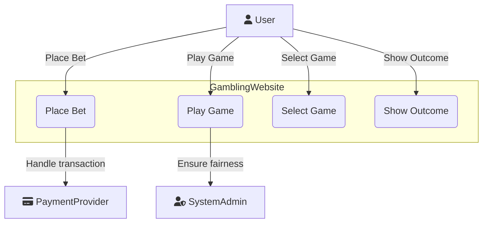
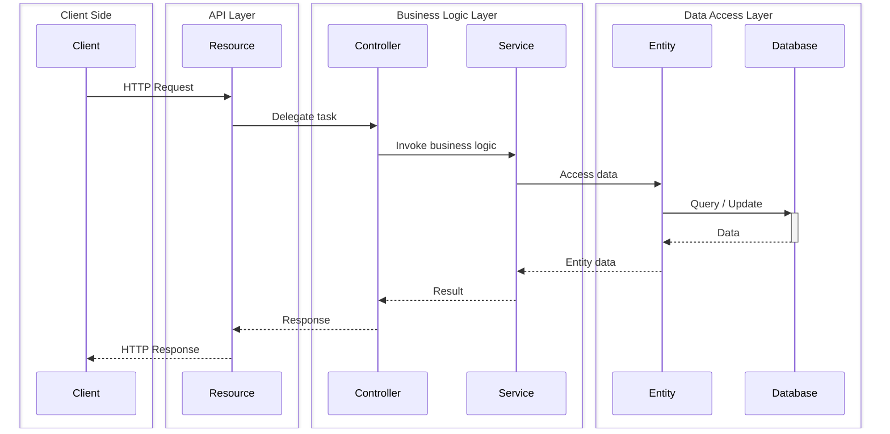
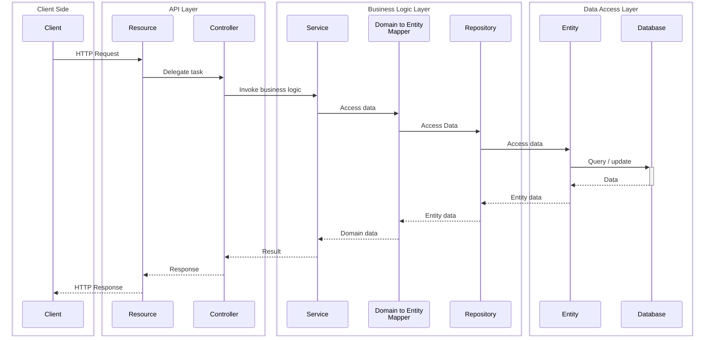

# Complex Systems and DevOps: Deliverable 1

**Date:** September 26, 2024

---

## Course Details

**Course Name:** Complex Systems and DevOps  
**Course Code:** 62582  
**Semester:** Fall 2024  

---

## Team Members

| Name                         | Student Number    |
|------------------------------|------------------|
| **Christoffer Fink**         | *s205449*         |
| **Kasper Falch Skov**        | *s205429*         |
| **Johan Søgaard Jørgensen**  | *s224324*         |
| **Henrik Lynggaard Skindhøj**| *s205464*         |
| **Kevin Wang Højgaard**      | *s195166*         |
| **Sebastian Halfdan Lauridsen** | *s215769*     |

[**Link to GitHub Project**](https://github.com/Complex-systems-and-devops-gruppe-8)  

---

## Table of Contents

- [Complex Systems and DevOps: Deliverable 1](#complex-systems-and-devops-deliverable-1)
  - [Course Details](#course-details)
  - [Team Members](#team-members)
  - [Table of Contents](#table-of-contents)
  - [Introduction](#introduction)
  - [Use Cases \& Stories](#use-cases--stories)
  - [Our Use Case \& User Stories](#our-use-case--user-stories)
    - [Main – UC 1.1. Diagram](#main--uc-11-diagram)
  - [US 1.1](#us-11)
    - [UC 1.1: Game Selection \& Play](#uc-11-game-selection--play)
      - [Use Case Section Description](#use-case-section-description)
      - [Stakeholders \& Interest](#stakeholders--interest)
      - [Main Success Scenario](#main-success-scenario)
      - [Extensions](#extensions)
    - [US 1.2](#us-12)
      - [UC 1.2: Game Outcome Processing](#uc-12-game-outcome-processing)
  - [Standalone Use Cases](#standalone-use-cases)
    - [UC 1.3: Betting Mechanics](#uc-13-betting-mechanics)
    - [UC 1.4: Backend Game Hosting](#uc-14-backend-game-hosting)
    - [Challenges](#challenges)
  - [Design](#design)
    - [Architecture](#architecture)
      - [Backend](#backend)
        - [Core](#core)
        - [Authentication](#authentication)
        - [Future plans and improvements](#future-plans-and-improvements)
    - [Design Decisions](#design-decisions)
  - [Implementation](#implementation)
    - [Frontend Development](#frontend-development)
      - [Routing](#routing)
      - [Component Structure](#component-structure)
      - [TypeScript Integration](#typescript-integration)
      - [Styling with Tailwind CSS](#styling-with-tailwind-css)
      - [Build Tool: Vite](#build-tool-vite)
  - [Test](#test)
      - [Testing objectives](#testing-objectives)
      - [Test types and strategies](#test-types-and-strategies)
      - [Enviroment setup for testing](#enviroment-setup-for-testing)
    - [Results](#results)
    - [Summary](#summary)
    - [Future Work](#future-work)
      - [Frontend Development](#frontend-development-1)
      - [Backend Security and Authentication](#backend-security-and-authentication)
      - [System Architecture and Development](#system-architecture-and-development)
      - [Package Management](#package-management)
      - [CI/CD Pipeline Enhancement](#cicd-pipeline-enhancement)
      - [Containerization and Cloud Services](#containerization-and-cloud-services)
      - [Full-stack Application Development](#full-stack-application-development)
    - [Short description of project management](#short-description-of-project-management)

---

## Introduction

In this project the goals is to design and implement the frontend and backend for a program, and manage the program by implementing the principles of DevOps. This program will be a gambling website that will feature games like poker, roulette and coinflip. 

The frontend will be implemented using the JavaScript framework React, paired with Vite as a build tool, and TypeScript, providing a satisfying user experience. The backend will be made with Java with Quarkus, a powerful framework for building Java applications, paired with PostgreSQL as the database. The backend will handle core functionality, like game logic, user authentication, and secure data management. Maven will be used for managing the project and build processes 

An important part of this project is to ensure the use of DevOps practices, to ensure that all components of the project are developed and deployed with automation and continous integration. Docker will be used for containerization, while GitHub and GitHub Actions will handle version control, automated testing, and deployment. The goal of this approach is to allow for frequent updates and efficient scaling.

This report will go through the design and implementation of the project, as well as how DevOps tools and methods has been applied currently, and how they will be used in the future. The current report is based on the work that has been done up to 2024-09-22.

## Use Cases & Stories

**Use Cases**
describe the interactions between a user (or another system) and the system itself to achieve a specific goal. They focus on what the system should do and define the steps involved in achieving the user's objectives, including different success and failure scenarios.

**User Stories** are short, simple descriptions of features told from the perspective of the end-user. They typically follow the format: "As a *type of user*, I want *goal* so that *benefit*." User stories help capture user needs and provide a foundation for creating detailed use cases.

## Our Use Case & User Stories

We used our user stories (US) to derive the corresponding use cases (UC). A use case diagram was created for the first use case, **Game Selection & Play,** to illustrate the system interactions.

### Main – UC 1.1. Diagram



The diagram shows the main interactions within the gambling website. The **User** selects games, places bets, plays, and views outcomes. The **Payment Provider** handles transactions, while the **System Admin** ensures game fairness and compliance.

## US 1.1

As a **Gambler**:

- I want an easy-to-navigate website where I can quickly access and select games, place wagers securely, and enjoy a fair gaming experience.
  
**So that:**

- I can participate in gambling activities seamlessly.

The primary use case involves enabling users to play a game and place wagers on it. Please note that elements marked as "Example" may not be included in our version of the program due to scope limitations. Subsequent use cases will include brief summaries, as the main flow has yet to be finalized for the sub use cases. All these use cases (including the main one) are **WIP** and will be subject to change.

### UC 1.1: Game Selection & Play

#### Use Case Section Description

**Name:** UC 1.1: Game selection & play

**Scope:**
- Selection of available games
- User interaction with game features
- Placing wagers
- Ensuring a fair and compliant gaming experience
- Secure transactions

**Primary actor:** User (gambler)

**Level:** cloud / level 0

#### Stakeholders & Interest

- **User:** Wants an easy-to-navigate webpage, easy access to games, and the ability to place wagers.
- **System Admin:** Needs to ensure that the games function smoothly, comply with legal regulations, and maintain fairness in wagers.
- **Payment Provider:** Interested in secure & fast transactions.

**Preconditions:**
- User must have an active account and be signed in.
- User must have sufficient funds in their account to play (free play if applicable).
- "The platform must be legal".

**Postconditions:**
- If the user wins, their account balance is updated with the winnings.
- If the user loses, the wager amount is deducted from their account balance.
- Game data, including the outcome and amount wagered, is stored in the system for auditing and regulatory purposes.
- The user has the option to leave feedback on the game or report any issues.

#### Main Success Scenario

1. **Game Lobby:**
   - User navigates to the Landing Page (home page for games).
   - The website displays a list of available games (e.g., slots, poker, blackjack, roulette) with categories like Top Games, New Releases, Jackpot Games, etc.
   - User sees options for sorting and filtering games by type, popularity, jackpot size, etc.
2. **Game Selection:**
   - User clicks on a game thumbnail to view detailed information about the game.
   - Information includes game rules, minimum/maximum bets, potential winnings, RTP (Return to Player) percentage, and a "Play Now" button.
3. **Game Loading:**
   - The system loads the selected game in the browser, initializing game assets and connecting to the game server if needed.
   - A loading screen shows the game logo or promotional visuals while waiting.
4. **Bet Placement:**
   - The user is presented with betting options (e.g., stake size for a slot machine, bet type for blackjack).
   - The user chooses the amount they want to wager and confirms the bet.
   - If applicable, the system checks the user’s available balance to ensure they have enough funds.
5. **Game Play:**
   - The game begins. For example:
     - **Slots:** User clicks "Spin" and watches the reels turn.
     - **Blackjack:** User receives virtual cards and makes decisions (hit, stand, etc.).
     - **Roulette:** User places bets on numbers or colors and watches the wheel spin.
   - The game result is calculated based on chance (RNG for slots, cards drawn, etc.).
   - If the user wins, the system calculates the winnings based on the game’s rules and updates the user's balance.
6. **Game Outcome:**
   - The game outcome (win/loss) is displayed on the screen.
   - If the user wins, they are shown a breakdown of the win (e.g., wager amount, multiplier, and total win).
   - If the user loses, they are notified of the loss and given the option to play again or exit.
7. **Game Exit:**
   - The user can choose to continue playing, select a new game, or exit to the main Game Lobby.
   - If the user exits, the system saves their current session (if applicable) for future retrieval.

#### Extensions

1. **Insufficient Funds:**
   - If the user doesn’t have enough funds to place a bet, they are notified and redirected to the deposit page.
   - They are offered an option to play in free/demo mode if available.
2. **Game Connection Loss:**
   - If the user loses connection during gameplay, the system saves the game state and restores it when they reconnect.
   - If the game outcome is already decided (e.g., a slot spin completes server-side), the user will see the result upon reconnecting.
3. **Bonus Play:**
   - If the user has an active bonus (e.g., free spins or match bonus), they are notified of the bonus during game selection.
   - The system tracks bonus progress and winnings separately from the user’s main balance.

**Frequency of Occurrence:** Every time the user wants to play a game.

---

### US 1.2

As a gambler:

- I want my winnings to be credited to my account and losses debited immediately after each game so I can track my balance.

#### UC 1.2: Game Outcome Processing

- Winnings are credited to the user’s account, and losses are debited.
- Storing game data for auditing, fairness checks, and regulatory compliance.

---

## Standalone Use Cases

Use cases without a corresponding user story.

### UC 1.3: Betting Mechanics

- Allowing users to place bets, select stakes, and confirm wagers.
- Handling different game types (e.g., slots, poker, blackjack, roulette).

### UC 1.4: Backend Game Hosting

- Hosting and managing games to ensure real-time gameplay.
- Dynamically scaling resources to handle user traffic.
- Processing game outcomes securely.
- Storing game data for compliance and auditing.
- Ensuring high availability, security, and fairness across all hosted games.

---

### Challenges

[Highlight the challenges encountered during analysis.]

## Design

### Architecture

[Overview of the system architecture.]

#### Backend
The backend of our system prioritizes modularity, scalability, and a clear separation of concerns. At its core, the architecture follows a layered pattern, which enhances maintainability and allows for seamless expansion as the system evolves.

##### Core

The backbone of our backend is composed of three primary components that work together to process requests and manage data. **Resources** serve as the initial touchpoints, handling incoming HTTP requests and defining the API endpoints that external systems interact with. These resources then delegate tasks to **Controllers**, which act as intermediaries in the architectural flow. Controllers bridge the gap between the external-facing resources and the internal business logic, facilitating the transition of data and operations.

The core of the system consists of **Services**, encapsulating business logic and domain-specific operations. This layered approach creates a clear, hierarchical flow of information and responsibility throughout the system. When an HTTP request arrives, it's received by the Resource layer, which then delegates to the corresponding Controller. The Controller, in turn, interacts with one or more Services to execute the necessary business logic. In some cases, Services may need to communicate with other Services or directly access the data layer to fulfill their responsibilities.

A key strength of the architecture is its modular organization. Rather than structuring components by their purpose, they are organized by domain. This approach enhances scalability and maintenance, as each domain — such as authentication or user management — has its own self-contained set of resources, controllers, and services. This structure makes it easier to add new features or modules and simplifies the process of maintaining and updating existing ones.

The following is a sequence diagram of the layered architecture.



##### Authentication

Security is an important concern in the system, and a robust authentication mechanism has been implemented to address this. By utilizing access tokens as JWTs and refresh tokens as UUIDs, the system provides both security and a good user experience. The limited lifespan of access tokens enhances security, while the revocable refresh tokens allows for better control over user sessions compared to using non-revocable JWTs alone.

##### Future plans and improvements

While the current implementation uses a direct connection to the database through entity classes, the architecture is designed with future improvements in mind. We plan to introduce a repository layer and domain-to-database model mappers, enhancing the system's flexibility and maintainability. The repository layer will further abstract data access from business logic, while the mappers will provide a clear separation between database representations and domain models. These additions will enhance the system's flexibility, maintainability, and adherence to clean architecture principles.

The next diagram shows our planned domain–database repository abstraction



### Design Decisions

[Discuss key design decisions and their rationale.]

## Implementation

### Frontend Development

The frontend of the project is developed using **React**, which is a JavaScript library used for building user interfaces. React uses a component-based architecture, which facilitates breaking down the UI into small reusable components. All these components have their own logic and rendering characteristics, which is useful for keeping a codebase clean and maintainable.

#### Routing

In the frontend, we utilize **React Router** for the routing of the application. This allows the user to navigate between different pages without doing a full page reload. This is done by wrapping a `Router` tag around different `Route` tags and specifying what component should be rendered if the user navigates to said routes.

```react
<Router>
  <Routes>
    <Route path="/" element={<LandingPage />} />
    <Route path="/coinflip" element={<CoinFlipPage />} />
    <Route path="/poker" element={<PokerPage />} />
    <Route path="/blackjack" element={<BlackjackPage />} />
  </Routes>
</Router>

```

#### Component Structure

Our component structure so far is such that each page in the application is built as a separate component. This means that we have four different page components:

- **LandingPage**: The first page of the application that the user will see.
- **PokerPage**: A page for the poker game.
- **CoinflipPage**: A page for the coin flip game.
- **BlackjackPage**: A page for the blackjack game.

These components are just empty at this point, but functionality will be developed further as the project progresses.

#### TypeScript Integration

The frontend is also built using **TypeScript**, which enables static type checking. This is useful to help catch errors during development rather than at runtime. TypeScript is best used by defining **interfaces** and **types** for components’ props and states. This ensures that data passed between components is structured correctly.

 
#### Styling with Tailwind CSS

To style the frontend, **Tailwind CSS** is used. Tailwind CSS is one of many CSS frameworks that makes it easier to style different components. One of the advantages of Tailwind is that it has built-in responsiveness, making it simple to create a layout that adapts to different screen sizes.

#### Build Tool: Vite

As for building the application, we use **Vite**. This is a build tool that focuses on the developer experience by enabling hot-reloading, which improves the experience for developers when working on the application.

## Test

This test plan describes our current approach, tools, and strategies to ensure the quality and stability of the full-stack application developed using the specified tech stack in this report for both the front and backend.
#### Testing objectives

- Ensure the application functions correctly across all integrated systems (backend, frontend, database).
- Validate application security features, particularly token management and authorization using JWT.
- Verify the frontend provides a seamless user experience with state management and responsive design.
- Ensure the CI/CD pipeline (GitHub Actions) operates effectively, catching bugs early in the build process.

#### Test types and strategies
 -  Unit testing (Backend & frontend) 
    - Each backend service (API endpoints, business logic, token management) will be tested individually.
    - Frontend components and utility functions will be tested for correctness using unit testing frameworks like Jest and React Testing Library.

 - Integration testing
    - Ensure the backend interacts correctly with the PostgreSQL database for CRUD operations.
    - Verify that the frontend communicates correctly with backend REST APIs.


 - End-to-end (E2E) testing
    - Using Cypress or Playwright, we will simulate real user interactions with the app for testing.
    - We will test critical flows such as authentication, CRUD operations, and state management scenarios.

 - Security testing
    - Security tests validate access control through the JWT-based authentication mechanism.  
    - Public endpoints (/hello/all) are tested to ensure they are accessible without authentication.
    - Protected endpoints (/hello/admin, /hello/user) are restricted based on roles, ensuring that:
      - Admin users have access to /hello/admin but are restricted from user-specific resources such as /hello/user.
      - User accounts have access to /hello/user, and proper identity checks are performed (e.g., user-specific greetings).
    - Token endpoints (/auth/token, /auth/token/refresh) are tested to verify proper handling of token creation, refresh, and expiration scenarios.
    - Tests ensure that unauthorized access attempts are met with appropriate error codes:
      - 401 Unauthorized for requests without valid tokens.

 - Performance Testing
    - To evaluate frontend performance, we will use Lighthouse to ensure optimal load times and responsiveness.
#### Enviroment setup for testing
- Local development
  - Tests are run in both the backend and frontend during local development and builds to ensure the application functions correctly across the full stack.
  - Backend tests include unit and integration tests, while frontend tests focus on component and UI logic validation.
  - Developers can run the tests continuously as they work on the application, ensuring immediate feedback and preventing integration issues before code is pushed to the repository.
- CI/CD (Github Actions)
  - In regards to the backend, the system first attempts to build the backend, and then runs the tests.
  - We do not deploy the backend yet, and no rollbacks or alerts are currently in place.
  - Each commit triggers automated test runs, and both unit and integration tests are part of the CI pipeline, ensuring no broken code is pushed further into the development process.


 

### Results
At this stage of the project, not all tests are set up, so not many results have been found. However, the results of the implemented tests help us understand and identify current problems and validate that our new implementations are correctly implemented.
 

### Summary
This project involves the development of a comprehensive gambling website featuring games like poker, roulette, and coinflip. The frontend is built using React, TypeScript, and Vite, ensuring a responsive and engaging user experience. The backend leverages Quarkus with Java and PostgreSQL to handle game logic, user authentication, and secure data management. Maven is used for project management and build automation, streamlining the development process.

A key focus of the project is the integration of DevOps practices, utilizing Docker for containerization and GitHub Actions for continuous integration and deployment. This approach facilitates frequent updates and efficient scaling, ensuring the platform remains robust and adaptable to user needs. The project emphasizes security through custom token-based authentication and follows a modular architecture to enhance maintainability and scalability. Comprehensive testing strategies are in place to ensure the quality and stability of the application across all components.

### Future Work
#### Frontend Development
Future enhancements will focus on applying advanced React patterns and hooks to improve state management and code reliability. The integration of centralized state management solutions will be explored to handle larger applications more efficiently.

#### Backend Security and Authentication
The project will continue to refine its custom token-based authentication system, ensuring robust security measures are in place. This includes setting up HTTPS certificates and configuring SSL/TLS for secure connections, as well as implementing rate limiting and input validation to prevent common web attacks.

#### System Architecture and Development 
Although the current architecture is based on a single service, future work will explore ways to optimize scalability and maintainability. This includes refining the existing service architecture and exploring efficient communication methods within the system.

#### Package Management
The project will focus on optimizing dependency management using Maven and npm, ensuring efficient handling of libraries and tools. Proper version control and semantic versioning strategies will be implemented to maintain consistency and reliability.

#### CI/CD Pipeline Enhancement
Enhancements to the CI/CD pipeline will include implementing automated testing at all levels and setting up continuous deployment pipelines for faster releases. Integrating static code analysis tools will further improve code quality and maintainability.

#### Containerization and Cloud Services 
The project will optimize Docker images for smaller sizes and faster build times, ensuring efficient deployment processes. While Kubernetes and serverless architectures are not currently in use, future exploration of these technologies may provide additional benefits.

#### Full-stack Application Development 
Continued development will focus on integrating frontend and backend components seamlessly, with an emphasis on real-time features using WebSockets or Server-Sent Events. The project aims to develop a robust API gateway for managing and securing application interactions.

---
**By focusing on these areas, the project will align closely with the course objectives, enhancing both the technical capabilities of the application and the skills of the development team.**

### Short description of project management
Our project management setup utilizes a GitHub organization named ["Complex-systems-and-devops-gruppe-8"](https://github.com/Complex-systems-and-devops-gruppe-8) to facilitate collaboration and resource allocation. Within this organization, we maintain three repositories: `.github`, `frontend`, and `backend`. The `.github` repository is used for managing the organization's profile and reports. The `frontend` and `backend` repositories house the respective codebases for client-side and server-side components. This structure enables efficient development practices and ensures all team members have access to necessary resources for seamless project execution.

We leverage GitHub Actions to automate our CI/CD pipelines, enhancing our development workflow by automating testing, building, and deployment processes directly within our GitHub repositories.

Project management in software development involves coordinating planning, execution, and delivery of projects to achieve specific goals efficiently. It encompasses using various tools and methodologies to manage resources, timelines, and risks effectively. Our setup applies selected frameworks for frontend and backend development, implements state management, sets up backend security, uses package managers, establishes CI/CD pipelines, and utilizes containerization for deployment. These practices guide the design and implementation of a full-stack application, integrating all elements to deliver a cohesive and functional product.
