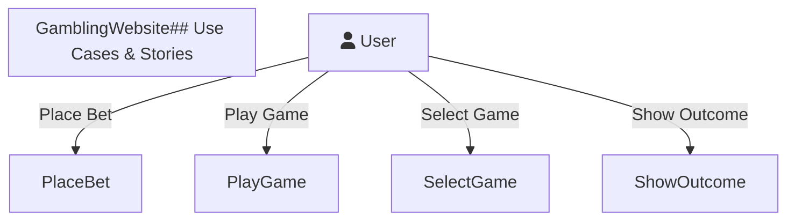
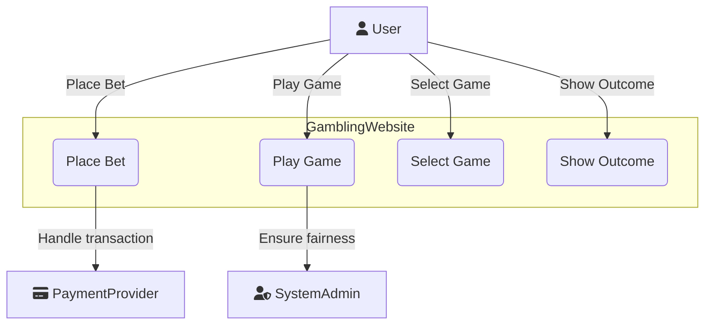

# Complex Systems and DevOps: Deliverable 2

**Date:** November 25, 2024

---

### Course Details

**Course Name:** Complex Systems and DevOps
**Course Code:** 62582
**Semester:** Fall 2024

---

### Team Members

| Name                            | Student Number |
|---------------------------------|----------------|
| **Christoffer Fink**            | *s205449*      |
| **Kasper Falch Skov**           | *s205429*      |
| **Johan Søgaard Jørgensen**     | *s224324*      |
| **Henrik Lynggaard Skindhøj**   | *s205464*      |
| **Kevin Wang Højgaard**         | *s195166*      |
| **Sebastian Halfdan Lauridsen** | *s215769*      |

[**Link to GitHub Project**](https://github.com/Complex-systems-and-devops-gruppe-8)

---

### Table of Contents

1. [Introduction](#introduction)
   - [Project Scope and Objectives](#project-scope-and-objectives)
   - [Problem Statement and Solution Overview](#problem-statement-and-solution-overview)
   - [Methodology](#methodology)

I. [Analysis](#analysis)

2. [Domain Analysis](#domain-analysis)
   - [User Stories and Requirements](#user-stories-and-requirements)
   - [System Architecture Overview](#system-architecture-overview)
   - [Technical Stack Selection](#technical-stack-selection)
   - [Security Requirements](#security-requirements)

3. [Technical Foundation](#technical-foundation)
   - [Framework Selection Rationale](#framework-selection-rationale)
   - [Development Environment Setup](#development-environment-setup)
   - [Project Structure](#project-structure)

II. [Implementation and DevOps Practices](#implementation-and-devops-practices)

4. [Backend Development](#backend-development)
   - [Quarkus Framework Implementation](#quarkus-framework-implementation)
   - [REST API Design with Siren Hypermedia](#rest-api-design-with-siren-hypermedia)
   - [Database Integration](#database-integration)
   - [Business Logic Implementation](#business-logic-implementation)
   - [Security Implementation](#security-implementation)
     - [JWT Authentication](#jwt-authentication)
     - [Backend Security Measures](#backend-security-measures)
   - [Testing Strategy](#testing-strategy)
     - [JUnit Implementation](#junit-implementation)
     - [REST-assured Testing](#rest-assured-testing)
   - [OpenAPI Documentation](#openapi-documentation)

5. [Frontend Development](#frontend-development)
   - [React Application Structure](#react-application-structure)
   - [TypeScript Integration](#typescript-integration)
   - [Vite Build Tool Implementation](#vite-build-tool-implementation)
   - [State Management](#state-management)
   - [Component Architecture](#component-architecture)
   - [Security Features](#security-features)
     - [Token Security Implementation](#token-security-implementation)
   - [Package Management](#package-management)

6. [DevOps Implementation](#devops-implementation)
   - [Version Control Practices](#version-control-practices)
     - [Git Workflow](#git-workflow)
     - [GitHub Integration](#github-integration)
   - [Continuous Integration/Continuous Deployment](#continuous-integrationcontinuous-deployment)
     - [GitHub Actions Configuration](#github-actions-configuration)
     - [Build Server Setup](#build-server-setup)
     - [Testing Pipeline](#testing-pipeline)
   - [Containerization](#containerization)
     - [Docker Implementation](#docker-implementation)
     - [Container Registry](#container-registry)
   - [Cloud Deployment](#cloud-deployment)
     - [Google Cloud Setup](#google-cloud-setup)
     - [Netlify Frontend Deployment](#netlify-frontend-deployment)
   - [Monitoring and Maintenance](#monitoring-and-maintenance)

7. [Conclusion](#conclusion)
   - [Project Outcomes](#project-outcomes)
   - [Future Improvements](#future-improvements)
   - [Lessons Learned](#lessons-learned)

---
### 1. Introduction

#### 1.1 Project Scope and Objectives

The goal of this project is to design and implement a full-stack gambling platform, with games such as roulette, and coin flip. 
The project includes the development of both a backend, a frontend, and the use of DevOps practices to improve the development and deployment processes.

The project will provide an secure and intuitive user experience. Software using modern frameworks and tools will be implemented. 
The project will be implemented with an emphasis on using the practices of DevOps to enable continous integration and deployment.

#### 1.2 Problem Statement and Solution Overview

##### Problem Statement:

In this project several challenges had to be overcome, these include:

- **Scalability:** Making it possible for several different users to play simultaneously, while maintaining uninterrupted gameplay.
- **Security:** Preventing exploitation of tokens, to prevent potential threats.
- **Maintainability:** Creating a system that can be updated and improvied without any significant overhead.
- **Deployment:** Developing a deployment process with frequent updates without downtime

##### Solution Overview:

The project addresses these challenges the following ways:

- A **React frontend** using **Vite** and **TypeScript** to create a user-friendly interface.
- A **Quarkus-based backend** written in Java to implement core functionalities such as game logic, authentication, and data management. **PostgreSQL** is used as the database for data storage.
- **DevOps practices**:
  - **Containerization** with Docker to provide environments that are consistent across development, testing, and production.
  - **Version control and automation** using GitHub and GitHub Actions for continuous integration and deployment.
- An emphasis on **secure authentication and authorization**, by using **JWT tokens** to manage user sessions effectively.

These approaches both addresses the technical challenges, and ensures that the platform is secure, and scalable.


#### 1.3 Methodology

The project follows the Agile methodology of iterative development in a manner that allows for easier addaptation to changes in requirements and the users needs. 
The process initiates with comprehensive requirements gathering and analysis, where user stories and use cases are written in detail to ensure alignment with end-user expectations. 
This approach promotes clarity of purpose for the project and lays a solid foundation for later phases in development.

The development phase involves the creation of both the frontend and backend, each designed with scalability, and maintainability in mind. 
The structure of the frontend is component-based, built with React and TypeScript, promoting reusability. This makes it easier for developers to update and extend the user interface every time something a new feature is implemented. 
The backend uses a layered architecture based on Quarkus, which isolates concerns into three layers for business logic, API endpoints, and data management. 
This makes the code cleaner and easier to scale, making it easier to integrate further features.

DevOps practices are integrated into the project to improve the development and deployment processes. Continuous integration and deployment pipelines will be implemented with the help of GitHub Actions where code builds, testing, and deployments are automated. It minimizes manual labour, reduces the possibilities of human errors, and speeds up the release cycle. Docker is used for containerization, which maintains the consistency of the environments throughout the development, testing, and production stages, enhancing reliability and simplifying the deployment process.

The deployment strategy adopted here is cloud-based, with the backend deployed to Google Cloud, and the frontend hosted on Netlify.

By integrating these methodologies, the project ensures a smooth development process, that's responsive to change.

## I. Analysis

### 2. Domain Analysis

#### User Stories and Requirements

## Use Cases & User Stories

The project has not fundamentally changed since the previous delivery, meaning there haven't been any changes to our requirements, use cases or user stories.
We used our user stories (US) to derive the corresponding use cases (UC). A use case diagram was created for the first use case, **Game Selection & Play,** to illustrate the system interactions.

### Main – UC 1.1. Diagram



**Use Cases**
describe the interactions between a user (or another system) and the system itself to achieve a specific goal.
They focus on what the system should do and define the steps involved in achieving the user's objectives, including different success and failure scenarios.

**User Stories** are short, simple descriptions of features told from the perspective of the end-user. They typically follow the format: "As a *type of user*, I want *goal* so that *benefit*." User stories help capture user needs and provide a foundation for creating detailed use cases.

## Our Use Case & User Stories

We used our user stories (US) to derive the corresponding use cases (UC). A use case diagram was created for the first use case, **Game Selection & Play,** to illustrate the system interactions.

### Main – UC 1.1. Diagram



The diagram shows the main interactions within the gambling website. The **User** selects games, places bets, plays, and views outcomes. The **Payment Provider** handles transactions, while the **System Admin** ensures game fairness and compliance.

## US 1.1

As a **Gambler**:

- I want an easy-to-navigate website where I can quickly access and select games, place wagers securely, and enjoy a fair gaming experience.
  
**So that:**

- I can participate in gambling activities seamlessly.

The primary use case involves enabling users to play a game and place wagers on it.
Please note that elements marked as "Example" may not be included in our version of the program due to scope limitations.
Subsequent use cases will include brief summaries, as the main flow has yet to be finalized for the sub use cases.
All these use cases (including the main one) are **WIP** and will be subject to change.

### UC 1.1: Game Selection & Play

#### Use Case Section Description

**Name:** UC 1.1: Game selection & play

**Scope:**

- Selection of available games
- User interaction with game features
- Placing wagers
- Ensuring a fair and compliant gaming experience
- Secure transactions

**Primary actor:** User (gambler)

**Level:** cloud / level 0

#### Stakeholders & Interest

- **User:** Wants an easy-to-navigate webpage, easy access to games, and the ability to place wagers.
- **System Admin:** Needs to ensure that the games function smoothly, comply with legal regulations, and maintain fairness in wagers.
- **Payment Provider:** Interested in secure & fast transactions.

**Preconditions:**

- User must have an active account and be signed in.
- User must have sufficient funds in their account to play (free play if applicable).
- "The platform must be legal".

**Postconditions:**

- If the user wins, their account balance is updated with the winnings.
- If the user loses, the wager amount is deducted from their account balance.
- Game data, including the outcome and amount wagered, is stored in the system for auditing and regulatory purposes.
- The user has the option to leave feedback on the game or report any issues.

#### Main Success Scenario

1. **Game Lobby:**
   - User navigates to the Landing Page (home page for games).
   - The website displays a list of available games (e.g., slots, poker, blackjack, roulette) with categories like Top Games, New Releases, Jackpot Games, etc.
   - User sees options for sorting and filtering games by type, popularity, jackpot size, etc.
2. **Game Selection:**
   - User clicks on a game thumbnail to view detailed information about the game.
   - Information includes game rules, minimum/maximum bets, potential winnings, RTP (Return to Player) percentage, and a "Play Now" button.
3. **Game Loading:**
   - The system loads the selected game in the browser, initializing game assets and connecting to the game server if needed.
   - A loading screen shows the game logo or promotional visuals while waiting.
4. **Bet Placement:**
   - The user is presented with betting options (e.g., stake size for a slot machine, bet type for blackjack).
   - The user chooses the amount they want to wager and confirms the bet.
   - If applicable, the system checks the user’s available balance to ensure they have enough funds.
5. **Game Play:**
   - The game begins. For example:
     - **Slots:** User clicks "Spin" and watches the reels turn.
     - **Blackjack:** User receives virtual cards and makes decisions (hit, stand, etc.).
     - **Roulette:** User places bets on numbers or colors and watches the wheel spin.
   - The game result is calculated based on chance (RNG for slots, cards drawn, etc.).
   - If the user wins, the system calculates the winnings based on the game’s rules and updates the user's balance.
6. **Game Outcome:**
   - The game outcome (win/loss) is displayed on the screen.
   - If the user wins, they are shown a breakdown of the win (e.g., wager amount, multiplier, and total win).
   - If the user loses, they are notified of the loss and given the option to play again or exit.
7. **Game Exit:**
   - The user can choose to continue playing, select a new game, or exit to the main Game Lobby.
   - If the user exits, the system saves their current session (if applicable) for future retrieval.

#### Extensions

1. **Insufficient Funds:**
   - If the user doesn’t have enough funds to place a bet, they are notified and redirected to the deposit page.
   - They are offered an option to play in free/demo mode if available.
2. **Game Connection Loss:**
   - If the user loses connection during gameplay, the system saves the game state and restores it when they reconnect.
   - If the game outcome is already decided (e.g., a slot spin completes server-side), the user will see the result upon reconnecting.
3. **Bonus Play:**
   - If the user has an active bonus (e.g., free spins or match bonus), they are notified of the bonus during game selection.
   - The system tracks bonus progress and winnings separately from the user’s main balance.

**Frequency of Occurrence:** Every time the user wants to play a game.


### US 1.2

As a gambler:

- I want my winnings to be credited to my account and losses debited immediately after each game so I can track my balance.

#### UC 1.2: Game Outcome Processing

- Winnings are credited to the user’s account, and losses are debited.
- Storing game data for auditing, fairness checks, and regulatory compliance.


## Standalone Use Cases

Use cases without a corresponding user story.

### UC 1.3: Betting Mechanics

- Allowing users to place bets, select stakes, and confirm wagers.
- Handling different game types (e.g., slots, poker, blackjack, roulette).

### UC 1.4: Backend Game Hosting

- Hosting and managing games to ensure real-time gameplay.
- Dynamically scaling resources to handle user traffic.
- Processing game outcomes securely.
- Storing game data for compliance and auditing.
- Ensuring high availability, security, and fairness across all hosted games.


#### System Architecture Overview

A lot of thought has gone into designing the system architecture for the program.
The architecture has been designed to ensure scalability, reliablity and to rely on DevOps principles.
Out approach enables efficient development, maintenance, and provides flexibility for future updates.
A detailed breakdown of the different architectural layers is provided below:

#### Architectural Layers:

1. **Presentation Layer (Frontend):**  

  The frontend consistes of the user interface part of the platform, with a focus on giving the user an intuitive experience. The tools that have been used to achieve this include:

  - The frontend has been developed with **React**, a modern JavaScript library used to build dynamic and interactive web interface.
  - The integration of **TypeScript** provides the program with type safety, reducing development errors and enhancing maintainability.
  - Navigation is handled with **React Router**, enabling a seamless transition between pages.
  - For the Styling of the program **Tailwind CSS** is used. Tailwind is a utility-first CSS framework that ensures responsive and consistent design across devices.

2. **Business Logic Layer (Backend):**  

  The backend is built using **Quarkus**, a cloud-native framework optimized for building lightweight and high-performing Java applications. It The most important business logic, including:

  - Secure authentication using **JWT** (JSON Web Tokens) for access and refresh tokens.
  - Modular services handling game logic, user balance management, and transaction workflows.
  - APIs for frontend interaction, designed with REST principles and using Hypermedia formats like **Siren** for enhanced discoverability.

3. **Data Access Layer (Database):**  

  Data management is another important part of the program, critical for the platform's integrity, handled by:

  - **PostgreSQL**, a powerful relational database for transactional data such as user balances, game outcomes, and transaction records.
  - Integration with **Hibernate**, simplifying database operations and maintaining a clean abstraction between domain models and database schemas.
  - Future enhancements include the implementation of repository patterns for improved data handling and scalability.


#### Technical Stack Selection

The technical stack for the project was chosen from the previous experiences of the group members, but also to meet the requirements of a modern, scalable web application.
Each component was picked to fit the experience of the group, the performance, reliablity and,alignment with project goals.

#### Frontend:

- **React:** A library used for building interactive and reuseable UI componenets. React supports dynamic updates without requiring a page reload, which makes for a better user experience.
- **TypeScript:** Provides static type checking, making the codebase more robust and reducing runtime errors.
- **Vite:** A build tool that offers fast build times and hot-reloading, making the work of the developer easier.
- **Tailwind CSS:** Simplifies responsive design implementation and ensures a consistent UI experience.

#### Backend:

- **Quarkus:** A Java framework tailored for microservices and cloud-native applications. Its fast startup time and low memory footprint make it ideal for the project.
- **PostgreSQL:** A reliable and scalable database for handling structured data, ensuring high availability and performance.
- **Hibernate:** An ORM tool that abstracts database interactions, reducing boilerplate code and enhancing maintainability.

#### DevOps and Deployment:

- **Docker:** Provides the project with consistent development and production environments through containerization.
- **GitHub Actions:** Used for automating the CI/CD pipeline, ensuring code quality and fast deployment.
- **Google Cloud & Netlify:** Supports scalable hosting for the backend and seamless deployment of the frontend.

#### Justification:

This stack has been designed to best fit the project's objectives, balancing modern features with stability. The stack supports easy development, ensures system reliability, and provides room for future enhancements, such as the integration of additional games.


#### Security Requirements

In this project, **JWT (JSON Web Tokens)** are used to restrict the amount of time a user can spent before they have to loggin again, this is done to manage user authentication and maintain session control. This approach is essential to ensure security on the site.

#### Use of JWT Tokens

- **Session Duration:** Each JWT has an expiration time, which decides when a user has to log in again.
- **Stateless Authentication:** This way the backend doesn't have to store any information, since the JWT contains all the necessary information to authenticate a user.

#### Advantages of Using JWT Tokens

1. **Efficiency:**  
   - JWT tokens are stateless, this means that the server doesn't need to maintain session data. This reduces the servers load.
   - The tokens carries all the required claims (e.g., username, user ID) within the token.

2. **Security:**  
   - The use of expiration times limits the duration of exposure if a token is compromised.
   - Tokens are signed using algorithms like **HMAC SHA-256**, making it impossible to tamper with the token, unless the signing key is exposed.

3. **Flexibility:**  
   - JWTs can be used across several different services and platforms, enabling easy integration in distributed systems.
   - Refresh tokens can be implemented to allow users to obtain new access tokens without the need to log in again.

#### Disadvantages of Using JWT Tokens

1. **Token Revocation Complexity:**  
   - Invalidating a token before it expires (in case of user logout), can be challenging, since the server does not store session data.
   - Implementation of token blacklists can add additional complexity and reduce the "stateless" advantage.

2. **Token Size:**  
   - JWT tokens can be large due to their payload, which may include claims and metadata. This can slightly increase bandwidth usage.

3. **Security Risks:**  
   - Attacks can forge valid tokens if the signing key is stolen.
   - Storing tokens on the client side can expose them to cross-site scripting (XSS) attacks

JWT tokens provide and efficient approach to session management, but must be implemented carefully to avoid the associated risks.
### 3. Technical Foundation

#### Framework Selection Rationale

#### Development Environment Setup

#### Project Structure

## II. Implementation and DevOps Practices

### 4. Backend Development

#### Quarkus Framework Implementation

#### REST API Design with Siren Hypermedia

#### Database Integration

#### Business Logic Implementation

#### Security Implementation

##### JWT Authentication

##### Backend Security Measures

#### Testing Strategy

##### JUnit Implementation

##### REST-assured Testing

#### OpenAPI Documentation

### 5. Frontend Development
#### React Application Structure

The project is a frontend application built using React with TypeScript, designed to provide an engaging and interactive user experience. It features a landing page with multiple sections, including clear navigation to different game pages. The application incorporates secure authentication with login and registration pages. Each game is implemented on its own dedicated page, leveraging a modular and structured approach. This design ensures scalability, allowing for seamless project expansion or simplification, while maintaining clean and maintainable code.

#### Key sections and features

The landing page is the first page of the application and where the user will start when they enter. It is built up by using several components that form the landing page when put together. 

```tsx
function LandingPage() {
  return (
    <div className="min-h-screen flex flex-col">
      <Header />
      <HeroSection />
      <GamesSection />
      <StartSection />
      <Footer />
    </div>
  );
}

export default LandingPage;
```

The `header` is at the top of the landing page, and serves as a navigation bar. It has the logo of the application and then links to different sections of the application: `login`, `register`etc. Below that is the `HeroSection`, where you would typically have a banner, welcoming the user onto the page and inviting them to navigate around the application to explore the different features. Further down is the `GamesSection` where the different implemented games are listed along with buttons that navigate to said games. Below that there is a "Start" section, which is the component that invites the user to sign up in order to play the games. Lastly a `Footer` is implemented, which is a generic footer containing copyright information and links to resources such as terms of service and privacy policy. The application also has seperate game pages, which when navigated to, shows each of the games.

#### Navigation and Routing

For routing in the application react-router-dom is used to enable navigation between different pages. The routes are defined in the index.tsx file, and currently contains routes for `blackjack`, `coinflip`, `register` and the `landing page`.

```tsx
ReactDOM.createRoot(document.getElementById('root') as HTMLElement).render(
  <React.StrictMode>
      <Router>
        <AuthProvider>
          <UserProvider>
          <Routes>
            <Route path="/" element={<LandingPage />} />
            <Route path="/coinflip" element={<CoinFlipPage />} />
            <Route path="/poker" element={<PokerPage />} />
            <Route path="/blackjack" element={<BlackjackPage />} />
            <Route path="/register" element={<RegisterPage />} />
          </Routes>
          </UserProvider>
        </AuthProvider>
    </Router>
  </React.StrictMode>
);
```

This setup makes it easy if new games are added, because they can just be added to the index file.

#### TypeScript Integration

The project is built with TypeScript, which makes it possible to do static type checking. This is super helpful in order to catch errors during development instead of having to catch them at runtime. Typescript and the static type checking is best used when defining interfaces and types for components props and states. This limits the data passed between componenets such that it has to be structured properly for the component to accept it.

#### Vite Build Tool Implementation

For building the application this project uses Vite. This is a popular build tool with some advantages mainly aimed at ease of use for the developers. The advantages include a really fast development server providing instant updates when changes are made to the code. It supports TypeScript out of the box, which minimizes the amount of work developers have to focus on configuring build pipelines. 

#### State Management

In this project, React's built in state management hooks are used. UseNavigation from react-router-dom is used to handle the navigation state and allows the user to navigate to different pages. Local states are also being used within the components with UseState. UseState can be used to handle specific UI states, for example when users are interacting with the application, or when dynamic content rendering is used.

In our application, we manage state efficiently using React's useContext in combination with a Provider. This approach centralizes state management, making the application easier to scale, maintain, and extend as the complexity of features grows.
With this setup:
* State stores the current application data.
* Dispatch handles updates and actions, ensuring predictable and controlled state transitions.

By wrapping our components in context Providers, any part of the application can access and modify the shared state without the need for cumbersome prop drilling, enhancing the overall developer experience.
We have implemented specific contexts and providers tailored to key areas of our application:
* Authentication Context: Manages authentication tokens, login status, and user session data.
* User Context: Handles user-specific information, such as profile details or preferences.
* Blackjack Context: Manages the state for our Blackjack game, including game logic, player actions, and dealer interactions.

This modular approach ensures that each context is focused on its specific domain, improving code organization and maintainability. By leveraging useContext and the Provider, we create a robust and scalable foundation for managing complex state transitions and interactions across the application while adhering to React’s functional component paradigm.

#### Security Features

##### Token Security Implementation
In our frontend application, we have chosen to store authentication tokens securely in cookies. This decision strikes a balance between usability and security, ensuring sensitive token data is protected while providing a seamless user experience.
The main reason cookies are optimal for token storage is their ability to include security features like the HttpOnly flag. This flag makes cookies inaccessible to JavaScript, significantly reducing the risk of XSS (Cross-Site Scripting) attacks. Additionally, the Secure flag ensures cookies are transmitted only over HTTPS, preventing exposure over unencrypted connections.
For token expiration, we enforce short lifetimes to limit the risk of misuse if a cookie is compromised. While the expiration mechanism is managed on the backend, it adds another layer of security by ensuring tokens do not remain valid indefinitely.
We store both the refresh token and access token in cookies. The frontend includes functionality to refresh the access token as its expiration approaches, ensuring uninterrupted user sessions. This mechanism allows users to remain logged in as long as they keep the site open. Moreover, cookies enable persistent login between visits. If the user closes the webpage and later reopens it, the application automatically checks if valid tokens exist in the cookies. If the tokens are not expired and can still be used, the user is logged back into the site seamlessly.
By leveraging cookies for token storage and refresh management, we provide a secure and user-friendly authentication experience.
#####  Input Validation and Sanitation
We perform input validation and sanitization in the frontend to protect our backend from malicious inputs and to catch invalid data early in the process. This proactive approach enhances security while improving the user experience by providing immediate feedback if the input does not meet our predefined standards. For instance, we enforce specific requirements for fields such as passwords and usernames, ensuring they comply with our security and usability guidelines before they are submitted to the server. To clarify, we also sanitize and validate inputs in the backend, but catching validation errors at the frontend enhances the overall system by reducing invalid requests sent to the server.
#####  Secure Communication (HTTPS)
Our frontend exclusively uses HTTPS to ensure that all data transmitted between the client and the server is encrypted. This protects sensitive information, such as authentication tokens and user data, from interception or tampering during transmission, maintaining the integrity and confidentiality of the communication.

#### Package Management
In our project, we utilize npm (Node Package Manager) as the primary package manager for frontend development. npm is a powerful tool that simplifies the process of managing dependencies and libraries required for the project. By specifying the necessary packages in the package.json file, npm allows us to efficiently install, update, and manage all dependencies in a structured and repeatable manner.

One of the key advantages of npm is its ability to define and execute custom scripts. These scripts streamline various development and build tasks. For example:

npm run dev: This command is configured to start a development server, providing a live-reloading environment that makes it easier to test and iterate on frontend code during development.
npm run build: This command specifies the steps required to build the production-ready version of the frontend application. It typically compiles, minifies, and optimizes the code for deployment.
Additionally, npm enhances the security of our project by providing the npm audit tool. This tool scans the project dependencies for known vulnerabilities and security threats. By running npm audit, we can:

 * Detect security issues in real-time across all installed libraries.
* Receive detailed reports on the nature of vulnerabilities, their severity, and potential fixes.
* Apply automated patches for certain vulnerabilities using npm audit fix.

By regularly auditing our dependencies, we ensure that our project remains secure and compliant with best practices, reducing the risk of threats from third-party libraries. As a future improvement, we could set up a GitHub Action to automatically create issues whenever vulnerabilities are detected during the auditing process. This automation would help us maintain a proactive approach to dependency management, ensuring timely resolution of potential security concerns.

In addition to managing dependencies and automating tasks, npm also enables us to run custom test suites. For instance, by specifying test commands in package.json, such as npm run test, we can execute different testing frameworks or tools to ensure the quality and stability of our code. This feature presents an opportunity for future improvement, as we plan to leverage it when implementing a comprehensive testing strategy for the frontend.

By leveraging npm for package management, task automation, and security auditing, we ensure that our frontend development workflow is consistent, efficient, and secure. It simplifies collaboration across the team, as all required dependencies and commands are easily accessible, while safeguarding the project against potential vulnerabilities.
#### Framework Selection Rationale

Our project uses **React** with **TypeScript** as the primary framework and language for the frontend, paired with **Vite** as the build tool. This choice is informed by the features we have discussed previously and is further supported by the following specific points:

**React:**

* Component-based architecture: Simplifies the development of reusable, modular, and scalable UI elements, enabling consistent design and functionality across the application.
* Robust ecosystem: With a large developer community, React provides abundant resources, libraries, and third-party integrations to address common challenges efficiently.
* Extensibility: React integrates seamlessly with tools such as react-router-dom for routing and state management libraries like Redux or Context API, making it versatile for various project needs.

**TypeScript:**

* Static type-checking: Reduces runtime errors by catching issues during development, ensuring more robust code.
* Enforces stricter coding standards: Enables explicit definitions for props, states, and API responses, fostering better collaboration and reducing ambiguity in the codebase.
* Enhanced maintainability: Improves code readability, simplifies debugging, and makes the project easier to scale.

**Vite:**

* Lightning-fast development server: Delivers near-instant hot module replacement (HMR), significantly boosting development speed and productivity.
* Ease of configuration: Requires minimal setup, letting developers focus on building the application rather than configuring the tooling.
* Optimized builds: Produces lightweight, high-performance builds that outperform traditional tools like Webpack, ensuring a smoother user experience.

This combination of React, TypeScript, and Vite provides a well-rounded stack that prioritizes development efficiency, scalability, and code quality. It is tailored to meet the demands of a modern, interactive frontend application, making it an ideal choice for our project.

#### Project Structure

Our project structure is meticulously designed to adhere to React best practices, ensuring maintainability, scalability, and readability of the codebase. We follow a component-based architecture, where each UI element is encapsulated in its own reusable and self-contained component. This approach promotes reusability and makes it easier to manage changes or updates.

We also emphasize clear separation of concerns by organizing files logically. For example, each component has its own directory containing its Typescript file, CSS (or module CSS for scoped styling), and any relevant assets. This structure ensures that related code is grouped together, making the project easier to navigate.

Another key best practice we follow is state management. For local state, we use React's useState and useReducer hooks, while global state is managed with Context API or third-party libraries, depending on the project requirements. For instance, in our authentication flow, we use Context API to share user and authentication states across the app, avoiding unnecessary prop drilling.

Finally, we focus on writing clean, readable code by adhering to consistent formatting rules enforced by tools like Prettier and ESLint. This ensures that all developers contribute code that follows a unified style, reducing friction during code reviews.

##### GitHub Workflow

- **ci.yml**: This file defines the GitHub workflow for automating key stages of our development pipeline, including building and testing the project before deployment. The workflow is triggered by specific events, such as pushing to the main branch or opening a pull request, ensuring that our codebase remains stable and free of regressions. By automating these processes, we reduce manual effort, maintain high code quality, and accelerate development cycles.

Further details about the setup, configuration, and implementation of the ci.yml file, as well as how it integrates with other DevOps practices, are discussed in the DevOps section of this report.
###### Source Directory (`src`)
Our project's directory structure is carefully designed to promote clarity, maintainability, and scalability, adhering to established best practices in React development
- **Components**: This folder contains individual React components, each in its own folder with associated files like .tsx. By isolating components, we ensure reusability, making it easier to share UI elements across pages. This modular approach also simplifies debugging and updating specific parts of the UI.
- **Pages**: Complete pages are created by assembling multiple components. This separation of "components" and "pages" enforces a clean hierarchy, where pages focus on layout and orchestration while components handle granular functionality. This approach improves readability and helps maintain a clear distinction between reusable pieces of UI and higher-level structures.
- **State**: The State folder centralizes state management, using Context API. This setup avoids scattering state-related code across the application, making it easier to debug, scale, and extend the application's logic.
- **Styling**: All .css files are grouped under this directory to maintain consistency in styling and enforce a separation of concerns. Using a dedicated folder allows developers to quickly locate and modify styles, whether they are global or scoped to specific components.
- **Tests**: Housing all test files in a single directory ensures that testing remains a first-class citizen in the project. It helps maintain an organized structure, where tests are easy to locate and run, and it encourages consistent testing practices across the team.

 ### 6. DevOps Implementation

#### Version Control Practices

##### Git Workflow

##### GitHub Integration

#### Continuous Integration/Continuous Deployment

##### GitHub Actions Configuration

##### Build Server Setup

##### Testing Pipeline

#### Containerization

##### Docker Implementation

##### Container Registry

#### Cloud Deployment

##### Google Cloud Setup

##### Netlify Frontend Deployment
In our project, we utilize Netlify as the platform for hosting and deploying our frontend application. Netlify offers an automated and seamless deployment workflow by integrating directly with our GitHub repository. Every time changes are pushed to the main branch, Netlify automatically pulls the latest code, runs the specified build command (npm run build), and deploys the application to its globally distributed Content Delivery Network (CDN).

As part of this automated process, Netlify provides real-time feedback on the deployment status. If the npm run build command succeeds, the application is immediately deployed, and the live site is updated. If the build fails, Netlify generates detailed logs, making it easy to identify and resolve any issues. After deployment, Netlify confirms whether the site was successfully deployed, ensuring full transparency in the deployment process.

In addition, for every pull request, Netlify runs a Lighthouse audit to evaluate the performance, accessibility, best practices, and SEO of the site. This feature provides a clear score and actionable insights, helping us continuously optimize the application before merging changes into the main branch. By catching potential issues at the pull request level, we ensure that only high-quality updates make it into production.

We have also implemented GitHub Actions as part of our CI/CD pipeline. These actions complement Netlify by automating additional checks, such as running unit tests, linting, and verifying configurations before deployment. GitHub Actions provide an extra layer of validation, ensuring that the codebase adheres to predefined quality standards and that potential issues are identified early in the development cycle.

Netlify’s integration with GitHub and the use of Github Actions significantly streamline our deployment process. Features like automatic builds, deployment status notifications, and Lighthouse audits on pull requests, we are able to maintain a high-quality frontend application. Its global CDN ensures that the deployed site loads quickly for users worldwide, further enhancing the user experience. By leveraging Netlify, we have a reliable, efficient, and developer-friendly solution for managing our frontend deployment pipeline.

Another of the key advantages of using Netlify is that it offers its core features for free, including automated builds, deployments, and a globally distributed CDN. This makes it an excellent choice for small teams or projects, allowing us to deploy a high-quality frontend application without incurring additional costs.

#### Monitoring and Maintenance

A key principle in DevOps is the ability to act based on metrics. To do this we use Micrometer metrics, a common monitoring facade which is vendor neutral, alike SLF4J is for logging. We use the Prometheus format as Quarkus provides a convenient library for combining these, `quarkus-micrometer-registry-prometheus`. To display and view these metrics we use Dashbuilder which allows easy visualization of the metric data via a YML format. Quarkus also has minimal config library for this, named `quarkus-dashbuilder`.

We have also looked into setting up a centralized logging system, but due to time constraints were unable to implement it in time for the writing of this report.

Another clear improvement is monitoring if our frontend server is up or overloaded.

### 7. Conclusion

#### Project Outcomes

#### Future Improvements

#### Lessons Learned

