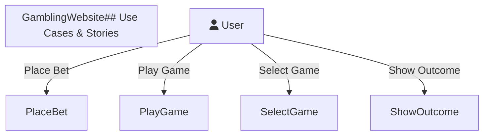
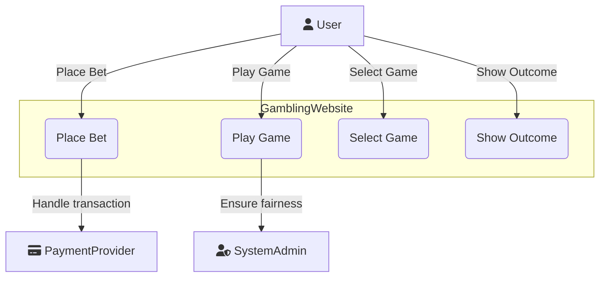

# Complex Systems and DevOps: Deliverable 2

**Date:** November 25, 2024

---

### Course Details

**Course Name:** Complex Systems and DevOps
**Course Code:** 62582
**Semester:** Fall 2024

---

### Team Members

| Name                            | Student Number |
|---------------------------------|----------------|
| **Christoffer Fink**            | *s205449*      |
| **Kasper Falch Skov**           | *s205429*      |
| **Johan Søgaard Jørgensen**     | *s224324*      |
| **Henrik Lynggaard Skindhøj**   | *s205464*      |
| **Kevin Wang Højgaard**         | *s195166*      |
| **Sebastian Halfdan Lauridsen** | *s215769*      |

[**Link to GitHub Project**](https://github.com/Complex-systems-and-devops-gruppe-8)

---

### Table of Contents

1. [Introduction](#introduction)
   - [Project Scope and Objectives](#project-scope-and-objectives)
   - [Problem Statement and Solution Overview](#problem-statement-and-solution-overview)
   - [Methodology](#methodology)

I. [Analysis](#analysis)

2. [Domain Analysis](#domain-analysis)
   - [User Stories and Requirements](#user-stories-and-requirements)
   - [System Architecture Overview](#system-architecture-overview)
   - [Technical Stack Selection](#technical-stack-selection)
   - [Security Requirements](#security-requirements)

3. [Technical Foundation](#technical-foundation)
   - [Framework Selection Rationale](#framework-selection-rationale)
   - [Development Environment Setup](#development-environment-setup)
   - [Project Structure](#project-structure)

II. [Implementation and DevOps Practices](#implementation-and-devops-practices)

4. [Backend Development](#backend-development)
   - [Quarkus Framework Implementation](#quarkus-framework-implementation)
   - [REST API Design with Siren Hypermedia](#rest-api-design-with-siren-hypermedia)
   - [Database Integration](#database-integration)
   - [Business Logic Implementation](#business-logic-implementation)
   - [Security Implementation](#security-implementation)
     - [JWT Authentication](#jwt-authentication)
   - [Testing Strategy](#testing-strategy)
     - [JUnit Implementation](#junit-implementation)
     - [REST-assured Testing](#rest-assured-testing)
   - [OpenAPI Documentation](#openapi-documentation)

5. [Frontend Development](#frontend-development)
   - [React Application Structure](#react-application-structure)
   - [TypeScript Integration](#typescript-integration)
   - [Vite Build Tool Implementation](#vite-build-tool-implementation)
   - [State Management](#state-management)
   - [Component Architecture](#component-architecture)
   - [Security Features](#security-features)
     - [Token Security Implementation](#token-security-implementation)
   - [Package Management](#package-management)

6. [DevOps Implementation](#devops-implementation)
   - [Version Control Practices](#version-control-practices)
     - [Git Workflow](#git-workflow)
     - [GitHub Integration](#github-integration)
   - [Continuous Integration/Continuous Deployment](#continuous-integrationcontinuous-deployment)
     - [GitHub Actions Configuration](#github-actions-configuration)
     - [Build Server Setup](#build-server-setup)
     - [Testing Pipeline](#testing-pipeline)
   - [Containerization](#containerization)
     - [Docker Implementation](#docker-implementation)
     - [Container Registry](#container-registry)
   - [Cloud Deployment](#cloud-deployment)
     - [Google Cloud Setup](#google-cloud-setup)
     - [Netlify Frontend Deployment](#netlify-frontend-deployment)
   - [Monitoring and Maintenance](#monitoring-and-maintenance)

7. [Conclusion](#conclusion)
   - [Project Outcomes](#project-outcomes)
   - [Future Improvements](#future-improvements)
   - [Lessons Learned](#lessons-learned)

---
### 1. Introduction

#### 1.1 Project Scope and Objectives

The goal of this project is to design and implement a full-stack gambling platform, with games such as roulette, and coin flip, with a focus on creating a secure and user-friendly experience. It will involve building both backend and frontend components using modern frameworks and tools, while integrating DevOps practices for continues integration and deployment.

The scope includes backend architechture, API development, frontend design, security measures, and cloud deployment. However, it excludes marketing strategies, and legal compliance beyond technical implementation. The objective is to deliver a reliable platform with efficient DevOps integration and an engaging user interface.

#### 1.2 Problem Statement and Solution Overview

##### Problem Statement:

In this project several challenges had to be overcome, these include:

- **Scalability:** Making it possible for several different users to play simultaneously, while maintaining uninterrupted gameplay.
- **Security:** Preventing exploitation of tokens, to prevent potential threats.
- **Maintainability:** Creating a system that can be updated and improvied without any significant overhead.
- **Deployment:** Developing a deployment process with frequent updates without downtime

Addressing these challenges is vital to delivering a reliable and engaging platform.

##### Solution Overview:

The project addresses these challenges the following ways:

- A **React frontend** using **Vite** and **TypeScript** to create a user-friendly interface.
- A **Quarkus-based backend** written in Java to implement core functionalities such as game logic, authentication, and data management. **PostgreSQL** is used as the database for data storage.
- **DevOps practices**:
  - **Containerization** with Docker to provide environments that are consistent across development, testing, and production.
  - **Version control and automation** using GitHub and GitHub Actions for continuous integration and deployment.
- An emphasis on **secure authentication and authorization**, by using **JWT tokens** to manage user sessions effectively.

These approaches both addresses the technical challenges, and ensures that the platform is secure, and scalable.


#### 1.3 Methodology

This project follows a Kanban methodology using GitHub Issues and Projects to emphasize continuous improvement and flexibility in task management. This methodology is based on a "pull system," where work items (Issues) are pulled from a backlog into a steady flow of work, rather than being pushed through the process.

Kanban is a methodology that focuses on visualizing work, limiting work-in-progress, and maximizing efficiency. It uses a Kanban board (GitHub Projects Board) to represent the workflow of our project. For our board, we chose to go with the columns: Backlog, Ready, In Progress, In Review and Done. Each Task/Issue is then represented as a card that can move through each column, providing a clear visual representation of the project's status.

Another key feature of Kanban is the limit you set on the In Progress column. This helps the team focus on completing tasks before starting new ones, reducing multitasking and improving efficiency. The size of the In Progress column is usually set to the teams size plus one. This allows each team member to focus on one task while providing a little flexibility for handling bottlenecks. Since Kanban does not prescribe specific roles or iterations, it is highly adaptable and fits well into our team structure.

Integrating Kanban with DevOps enhances workflow efficiency and flexibility by using a pull system and visual task management. This aligns with DevOps principles like CI/CD, ensuring a seamless workflow. This approach not only improves task management but also supports continuous improvement and adaptability, key aspects of both Kanban and DevOps.
## I. Analysis

### 2. Domain Analysis

#### User Stories and Requirements

## Use Cases & User Stories

The project has not fundamentally changed since the previous delivery, meaning there haven't been any changes to our requirements, use cases or user stories.
We used our user stories (US) to derive the corresponding use cases (UC). A use case diagram was created for the first use case, **Game Selection & Play,** to illustrate the system interactions.

### Main – UC 1.1. Diagram



**Use Cases**
describe the interactions between a user (or another system) and the system itself to achieve a specific goal.
They focus on what the system should do and define the steps involved in achieving the user's objectives, including different success and failure scenarios.

**User Stories** are short, simple descriptions of features told from the perspective of the end-user. They typically follow the format: "As a *type of user*, I want *goal* so that *benefit*." User stories help capture user needs and provide a foundation for creating detailed use cases.

## Our Use Case & User Stories

We used our user stories (US) to derive the corresponding use cases (UC). A use case diagram was created for the first use case, **Game Selection & Play,** to illustrate the system interactions.

### Main – UC 1.1. Diagram



The diagram shows the main interactions within the gambling website. The **User** selects games, places bets, plays, and views outcomes. The **Payment Provider** handles transactions, while the **System Admin** ensures game fairness and compliance.

## US 1.1

As a **Gambler**:

- I want an easy-to-navigate website where I can quickly access and select games, place wagers securely, and enjoy a fair gaming experience.
  
**So that:**

- I can participate in gambling activities seamlessly.

The primary use case involves enabling users to play a game and place wagers on it.
Please note that elements marked as "Example" may not be included in our version of the program due to scope limitations.
Subsequent use cases will include brief summaries, as the main flow has yet to be finalized for the sub use cases.
All these use cases (including the main one) are **WIP** and will be subject to change.

### UC 1.1: Game Selection & Play

#### Use Case Section Description

**Name:** UC 1.1: Game selection & play

**Scope:**

- Selection of available games
- User interaction with game features
- Placing wagers
- Ensuring a fair and compliant gaming experience
- Secure transactions

**Primary actor:** User (gambler)

**Level:** cloud / level 0

#### Stakeholders & Interest

- **User:** Wants an easy-to-navigate webpage, easy access to games, and the ability to place wagers.
- **System Admin:** Needs to ensure that the games function smoothly, comply with legal regulations, and maintain fairness in wagers.
- **Payment Provider:** Interested in secure & fast transactions.

**Preconditions:**

- User must have an active account and be signed in.
- User must have sufficient funds in their account to play (free play if applicable).
- "The platform must be legal".

**Postconditions:**

- If the user wins, their account balance is updated with the winnings.
- If the user loses, the wager amount is deducted from their account balance.
- Game data, including the outcome and amount wagered, is stored in the system for auditing and regulatory purposes.
- The user has the option to leave feedback on the game or report any issues.

#### Main Success Scenario

1. **Game Lobby:**
   - User navigates to the Landing Page (home page for games).
   - The website displays a list of available games (e.g., slots, poker, blackjack, roulette) with categories like Top Games, New Releases, Jackpot Games, etc.
   - User sees options for sorting and filtering games by type, popularity, jackpot size, etc.
2. **Game Selection:**
   - User clicks on a game thumbnail to view detailed information about the game.
   - Information includes game rules, minimum/maximum bets, potential winnings, RTP (Return to Player) percentage, and a "Play Now" button.
3. **Game Loading:**
   - The system loads the selected game in the browser, initializing game assets and connecting to the game server if needed.
   - A loading screen shows the game logo or promotional visuals while waiting.
4. **Bet Placement:**
   - The user is presented with betting options (e.g., stake size for a slot machine, bet type for blackjack).
   - The user chooses the amount they want to wager and confirms the bet.
   - If applicable, the system checks the user’s available balance to ensure they have enough funds.
5. **Game Play:**
   - The game begins. For example:
     - **Slots:** User clicks "Spin" and watches the reels turn.
     - **Blackjack:** User receives virtual cards and makes decisions (hit, stand, etc.).
     - **Roulette:** User places bets on numbers or colors and watches the wheel spin.
   - The game result is calculated based on chance (RNG for slots, cards drawn, etc.).
   - If the user wins, the system calculates the winnings based on the game’s rules and updates the user's balance.
6. **Game Outcome:**
   - The game outcome (win/loss) is displayed on the screen.
   - If the user wins, they are shown a breakdown of the win (e.g., wager amount, multiplier, and total win).
   - If the user loses, they are notified of the loss and given the option to play again or exit.
7. **Game Exit:**
   - The user can choose to continue playing, select a new game, or exit to the main Game Lobby.
   - If the user exits, the system saves their current session (if applicable) for future retrieval.

#### Extensions

1. **Insufficient Funds:**
   - If the user doesn’t have enough funds to place a bet, they are notified and redirected to the deposit page.
   - They are offered an option to play in free/demo mode if available.
2. **Game Connection Loss:**
   - If the user loses connection during gameplay, the system saves the game state and restores it when they reconnect.
   - If the game outcome is already decided (e.g., a slot spin completes server-side), the user will see the result upon reconnecting.
3. **Bonus Play:**
   - If the user has an active bonus (e.g., free spins or match bonus), they are notified of the bonus during game selection.
   - The system tracks bonus progress and winnings separately from the user’s main balance.

**Frequency of Occurrence:** Every time the user wants to play a game.


### US 1.2

As a gambler:

- I want my winnings to be credited to my account and losses debited immediately after each game so I can track my balance.

#### UC 1.2: Game Outcome Processing

- Winnings are credited to the user’s account, and losses are debited.
- Storing game data for auditing, fairness checks, and regulatory compliance.


## Standalone Use Cases

Use cases without a corresponding user story.

### UC 1.3: Betting Mechanics

- Allowing users to place bets, select stakes, and confirm wagers.
- Handling different game types (e.g., slots, poker, blackjack, roulette).

### UC 1.4: Backend Game Hosting

- Hosting and managing games to ensure real-time gameplay.
- Dynamically scaling resources to handle user traffic.
- Processing game outcomes securely.
- Storing game data for compliance and auditing.
- Ensuring high availability, security, and fairness across all hosted games.


#### System Architecture Overview

A lot of thought has gone into designing the system architecture for the program.
The architecture has been designed to ensure scalability, reliablity and to rely on DevOps principles.
Out approach enables efficient development, maintenance, and provides flexibility for future updates.
A detailed breakdown of the different architectural layers is provided below:

#### Architectural Layers:

1. **Presentation Layer (Frontend):**  

  The frontend consistes of the user interface part of the platform, with a focus on giving the user an intuitive experience. The tools that have been used to achieve this include:

  - The frontend has been developed with **React**, a modern JavaScript library used to build dynamic and interactive web interface.
  - The integration of **TypeScript** provides the program with type safety, reducing development errors and enhancing maintainability.
  - Navigation is handled with **React Router**, enabling a seamless transition between pages.
  - For the Styling of the program **Tailwind CSS** is used. Tailwind is a utility-first CSS framework that ensures responsive and consistent design across devices.

2. **Business Logic Layer (Backend):**  

  The backend is built using **Quarkus**, a cloud-native framework optimized for building lightweight and high-performing Java applications. It The most important business logic, including:

  - Secure authentication using **JWT** (JSON Web Tokens) for access and refresh tokens.
  - Modular services handling game logic, user balance management, and transaction workflows.
  - APIs for frontend interaction, designed with REST principles and using Hypermedia formats like **Siren** for enhanced discoverability.

3. **Data Access Layer (Database):**  

  Data management is another important part of the program, critical for the platform's integrity, handled by:

  - **PostgreSQL**, a powerful relational database for transactional data such as user balances, game outcomes, and transaction records.
  - Integration with **Hibernate**, simplifying database operations and maintaining a clean abstraction between domain models and database schemas.
  - Future enhancements include the implementation of repository patterns for improved data handling and scalability.


#### Technical Stack Selection

The technical stack for the project was chosen from the previous experiences of the group members, but also to meet the requirements of a modern, scalable web application.
Each component was picked to fit the experience of the group, the performance, reliablity and,alignment with project goals.

#### Frontend:

- **React:** A library used for building interactive and reuseable UI componenets. React supports dynamic updates without requiring a page reload, which makes for a better user experience.
- **TypeScript:** Provides static type checking, making the codebase more robust and reducing runtime errors.
- **Vite:** A build tool that offers fast build times and hot-reloading, making the work of the developer easier.
- **Tailwind CSS:** Simplifies responsive design implementation and ensures a consistent UI experience.

#### Backend:

- **Quarkus:** A Java framework tailored for microservices and cloud-native applications. Its fast startup time and low memory footprint make it ideal for the project.
- **PostgreSQL:** A reliable and scalable database for handling structured data, ensuring high availability and performance.
- **Hibernate:** An ORM tool that abstracts database interactions, reducing boilerplate code and enhancing maintainability.

#### DevOps and Deployment:

- **Docker:** Provides the project with consistent development and production environments through containerization.
- **GitHub Actions:** Used for automating the CI/CD pipeline, ensuring code quality and fast deployment.
- **Google Cloud & Netlify:** Supports scalable hosting for the backend and seamless deployment of the frontend.

#### Justification:

This stack has been designed to best fit the project's objectives, balancing modern features with stability. The stack supports easy development, ensures system reliability, and provides room for future enhancements, such as the integration of additional games.


#### Security Requirements

In this project, **JWT (JSON Web Tokens)** are used to restrict the amount of time a user can spent before they have to loggin again, this is done to manage user authentication and maintain session control. This approach is essential to ensure security on the site.

#### Use of JWT Tokens

- **Session Duration:** Each JWT has an expiration time, which decides when a user has to log in again.
- **Stateless Authentication:** This way the backend doesn't have to store any information, since the JWT contains all the necessary information to authenticate a user.

#### Advantages of Using JWT Tokens

1. **Efficiency:**  
   - JWT tokens are stateless, this means that the server doesn't need to maintain session data. This reduces the servers load.
   - The tokens carries all the required claims (e.g., username, user ID) within the token.

2. **Security:**  
   - The use of expiration times limits the duration of exposure if a token is compromised.
   - Tokens are signed using algorithms like **HMAC SHA-256**, making it impossible to tamper with the token, unless the signing key is exposed.

3. **Flexibility:**  
   - JWTs can be used across several different services and platforms, enabling easy integration in distributed systems.
   - Refresh tokens can be implemented to allow users to obtain new access tokens without the need to log in again.

#### Disadvantages of Using JWT Tokens

1. **Token Revocation Complexity:**  
   - Invalidating a token before it expires (in case of user logout), can be challenging, since the server does not store session data.
   - Implementation of token blacklists can add additional complexity and reduce the "stateless" advantage.

2. **Token Size:**  
   - JWT tokens can be large due to their payload, which may include claims and metadata. This can slightly increase bandwidth usage.

3. **Security Risks:**  
   - Attacks can forge valid tokens if the signing key is stolen.
   - Storing tokens on the client side can expose them to cross-site scripting (XSS) attacks

JWT tokens provide and efficient approach to session management, but must be implemented carefully to avoid the associated risks.
### 3. Technical Foundation

#### Framework Selection Rationale

#### Development Environment Setup

#### Project Structure

## II. Implementation and DevOps Practices

### 4. Backend Development

The backend is the single source of truth in the form of a REST API, which the frontend can interact with. There are two main areas which are handled by the backend.

1. Business logic:
    As with any logic handling money or other sensitive data, these operations must be done in an environment where bad actors or clueless users cannot alter the result. Therefore, since we are developing a gambling site, the actual game logic and results are calculated, handled and stored only in the backend. Our backend has API endpoints for playing games for users such as the stateless coin-flip endpoint.

    ```json
   	{
  		"actions": [
    		{
      			"name": "play",
      			"method": "POST",
      			"href": "/game/coin-flip",
      			"type": "application/json",
      			"fields": [
        			{
						"name": "choice",
						"type": "TEXT",
						"options": [
            				{ "value": "HEADS", },
            				{ "value": "TAILS", }
          				]
        			},
        			{
          				"name": "betAmount",
          				"type": "NUMBER",
        			}
      			]
    		},
    		{
      			"name": "result",
      			"method": "GET",
      			"href": "/game/coin-flip/{id}",
      			"type": "application/x-www-form-urlencoded"
    		}
  		],
  		"links": [ { "rel": [ "self" ], "href": "/game/coin-flip" } ]
	}
    ```

    *Simplified response listing the actions and links available on `/game/coin-flip`.*
	
	If the above JSON did not give it away, the API exposes hypermedia to alter and interact with the state of the backend. Exactly how will be discussed later, for now the most important aspect of the request is that we have two endpoints to interact with the coin-flip game. We can either

		1. Play the game via the POST method
		2. Get the result of a specific coin-flip game.

	As mentioned before, this game is stateless, meaning once a client POST's or rather plays the coin-flip game, the result of the game is immediately calculated, saved and an ID linking to the result is returned for the client to consume via the second action `GET /game/coin-flip/{id}. An example finished game could be the following json

	```json
	{
  		"properties": {
    		"betAmount": 100,
    		"gameResult": "USER_LOSE",
    		"userChoice": "HEADS",
    		"id": 1,
    		"result": "TAILS"
  		},
  		"links": [ { "rel": [ "self" ], "href": "/game/coin-flip/1" } ]
	}
	```

    *Simplified response for a specific coin-flip game.*
	
	Here after sending a `POST` request with the body `{ "choice": "HEADS", "betAmount": 100 }`, the user lost as the result was "TAILS".

2. Users:
	The second main area of our API is handling users and authentication. We decided, to challenge ourselves and roll our own authentication and JWT tokens, the exact specifics of the JWT tokens and how they are created and managed will be examined later. In short, if a user wants to play a game they must first be registered and authenticate with a username and password to retrieve a short lived *access-token* (JWT) and a long lived *refresh-token* (UUID). The *access-token* grants the user access to locked endpoints based on the user's assigned roles like playing the coin-flip game and the *refresh-token* allows a user to refresh the *access-token* before it expires to create a new *access-token*. This is to reduce the number of times a user must send their credentials to the backend for increased security. If the *access-token* expires the user must login again with credentials and the same is true for the *refresh-token*.

#### Quarkus Framework Implementation

Our choice of programming language and then framework was not up for much debate. We all have some experience with Java and therefore it was an obvious choice. However, instead of selecting Spring as our web framework we chose Quarkus for variation. Quarkus alike Spring supports the Jakarta EE standards meaning many of the core principles of developing a web server is the same between them. We chose Quarkus over Spring for a mild challenge in something new but familiar.

Quarkus is a performant container first web application and microservice framework. For our needs we utilized the web server components for constructing an API to accomodate our gambling website's business logic and user management. The main benefits we have utilized from a web application framework such as Quarkus is the ease of adding native but tailored components. As an example, we will delve into JWT tokens and how we use them later. The other main benefit of such a framework is Jakarta bean validation and dependency injection. We use this liberally with the `@Inject` annotation for *injecting* a class into another without having to manually construct it or the like. Instead Quarkus takes care of the scope of the class via `@RequestScoped` or `@ApplicationScoped` among a few others to figure out when and how a new instance of a class will be created and injected.

```java
@ApplicationScoped
public class AuthService {

    @Inject
    TokenService tokenService;

    @Inject
    UserService userService;

    //...
}
```

*Simplified implementation of the `AuthService` class.*

Another key aspect of using Quarkus is the ease of creating a web application, specifically selecting which endpoints or resources should be exposed with what method.

```java
@Path("/auth")
@Produces(Siren4J.JSON_MEDIATYPE)
public class AuthResource {

    //...

    @GET
    @Path("/")
    public Entity getAuth() throws Siren4JException {
        //...
    }

    @POST
    @Path("/token")
    @Consumes(MediaType.APPLICATION_JSON)
    public Entity createToken(CreateTokenRequest credentials) {
        //...
    }

    @POST
    @Path("/token/refresh")
    @Consumes(MediaType.APPLICATION_JSON)
    public Entity refreshAccessToken(RefreshAccessTokenRequest request) {
        //...
    }
}
```

*Simplified implementation of the `AuthResource` class.*

Simple annotations define 

- the top level path for the class or relative function level path via the `@Path` annotation,
- the common return type for all the endpoints in the class via the `@Produces` annotation,
- the HTTP method of the function via the `@GET`, `@PUT`, `@POST`, etc. annotations,
- the accepted Content-Type for a method via the `@Consumes` annotation and
- many other handy and useful features.

#### Maven

Before delving deeper into the implementation of the backend we will quickly go over our selected package manager for the backend. *Maven* is a robust build automation and dependency management tool that has become the de facto standard for Java projects. Its XML-based project configuration, exemplified in the Project Object Model (POM) file, provides a comprehensive framework for managing project dependencies, building processes, and project documentation.

Maven's primary advantages over alternative package managers like Gradle or Ant stem from its convention-over-configuration approach and its centralized dependency management system. The tool utilizes a standardized project structure and build lifecycle, significantly reducing the complexity of project configuration while maintaining consistency across different development environments.

The provided POM file demonstrates Maven's sophisticated dependency management capabilities through its structured organization of project elements:

1. Core project information is defined through fundamental coordinates (groupId, artifactId, version)
2. Properties section manages version numbers and configuration parameters centrally
3. Dependencies are clearly organized with explicit version management
4. Build process is configured through a plugin system that handles compilation, testing, and packaging

Maven's repository system represents another significant advantage, offering:

- Centralized artifact storage in local and remote repositories
- Transitive dependency resolution
- Version conflict management
- Efficient dependency caching

The tool's integration with Quarkus, as can be seen in the backend's `pom.xml` file, exemplifies its extensibility through plugins and its ability to support modern development frameworks. The configuration demonstrates Maven's capability to handle complex build requirements, including test execution, code generation, and native image creation, while maintaining a clear and maintainable project structure.

#### REST API Design with Siren Hypermedia

The backend architecture evolved from a basic Level 3 REST implementation utilizing standard HTTP methods (GET, POST, DELETE) to incorporate HATEOAS (Hypermedia as the Engine of Application State) capabilities. This enhancement enables dynamic API navigation through hypermedia controls, where clients discover available resources and operations by traversing links from the root endpoint rather than relying on predefined URL patterns. The hypermedia approach mirrors web browsing behavior, where navigation occurs through semantic controls rather than explicit URL construction. For example, rather than hardcoding paths to submit orders, clients can programmatically follow named links to execute operations. This design pattern eliminates the need for clients to maintain URL knowledge or external API documentation, as the server communicates available state transitions through hypermedia responses. The implementation effectively transforms HTTP interactions from direct URL manipulation to a state machine driven by discoverable, context-aware controls.

We chose Siren as our hypermedia specification, although we also considered HAL and HAL-FORMS, but found HAL to be too primitive and HAL-FORMS to have insufficient support in Quarkus. Siren is an extension of the JSON format, `application/vnd.siren+json`. It has 5 main components.

1. Properties

    The `properties` keyword is an optional reserved keyword which alike in a traditional JSON response describes the state of an entity. 

    ```JSON
    {
        "properties": {
            "id": 1,
            "username": "admin"
        }
    }
    ```

    *Example properties in Siren.*

2. Links

    The `links` keyword is a required keyword. A staple of hypermedia is that it enables the discoverability and relational nature of APIs. A given resource is required to contain the `self` relation with an `href` to the very URL or resource the client is viewing. Other common relations are, for pagination, "prev" or "next", as well as other closely related resources.

    ```JSON
    {
        "links": [
            { "rel": [ "self" ], "href": "/users/1" }
        ]
    }
    ```

    *Example self link in Siren.*

3. Entities

    The `entities` keyword is optional but usually used for collections. For example the endpoint `/users` probably returns a collection of all the users in the system. An API architect can decide to embed the full resource or a partial representation of it. A client may then see the full resource representation by navigating via the entity's "self" `rel`.

    ```JSON
    {
        "entities": [
            {
                "class": [ "user" ],
                "rel": [ "item" ],
                "properties": {
                    "id": 1,
                    "username": "admin"
                },
                "links": [ { "rel": [ "self" ], "href": "/users/1" } ]
            },
            {
                "class": [ "user" ], 
                "rel": [ "item" ],
                "properties": {
                    "id": 2,
                    "username": "user"
                },
                "links": [ { "rel": [ "self" ], "href": "/users/2" } ]
            }
        ]
    }
    ```

    *Example users entities list in Siren.*

4. Actions

    The `actions` keyword is an optional list of all related actions to the retrieved resource. Usually reserved for more advanced request like path templated GET requests `/users/{id}` or POST and PUT methods which may require specific contents in their request bodies. Actions were the missing piece for us when contemplating the incorporation of HAL. Without them a hypermedia API in our opinion is inadequate.

    ```JSON
    {
        "actions": [
            {
                "name": "create-user",
                "method": "POST",
                "href": "/users",
                "title": "Create user",
                "type": "application/json",
                "fields": [
                    {
                        "name": "username",
                        "title": "Username",
                        "type": "TEXT",
                        "required": true
                    },
                    {
                        "name": "password",
                        "title": "Plain-text password",
                        "type": "TEXT",
                        "required": true
                    }
                ]
            }
        ]
    }
    ```

    *Example "create-user" action in Siren.*

    The resulting generic request for an action would be

    ```sh
    curl -X '{action method}' \
        -H "Content-Type: {action type}" \
        -d '{
            # for each field in the action:
            "{field name}": "<value>"
        }' \
        {action href}
    ```

    *Generic `curl` command when parsing Siren actions.*

    For the specific "create-user" action above the request would be

    ```sh
    curl -X POST \
        -H "Content-Type: application/json" \
        -d '{
          "username": "JohnDoe",
          "password": "password1234"
        }' \
        /users
    ```

    *Example "create-user" action as a `curl` command.*

5. Class

    The final main component of the Siren specification is the optional `class` keyword. It describes the nature of an entity's content, usually it is used as a descriptor for the returned resource.

    See the previous `entities` component for an example.

We chose a third party library for our Siren implementation. Unlike Spring with its format agnostic `WebMvcLinkBuilder`, Quarkus lacks a mature and cohesive hypermedia builder, hence we selected what we believe to be the most intuitive and feature rich Java Siren library, Siren4J. This library contains both a builder like the Spring WebMvcLinkBuilder for more custom runtime responses but so far we have only used the resource API through annotations.

A simple resource like our root `/` resource contains discoverable links to other areas and resources of our API.

```java
@Siren4JEntity(entityClass = "root", uri = "/", links = {
    @Siren4JLink(rel = "users", href = "/users"),
    @Siren4JLink(rel = "auth", href = "/auth"),
    @Siren4JLink(rel = "game", href = "/game")
})
public class GetRootResponse {
}
```

*The `GetRootResponse` class implementation.*

Notice we link to three resources: "users", "auth" and "game", each with their own path "/users" "/auth" and "/game". To properly serialize this response we use Siren4Js - admittedly slow - `ReflectingConverter` to convert the Java object into a Siren `Entity`.

```java
@ApplicationScoped
public class RootController {

    public Entity getRoot() throws Siren4JException {
        GetRootResponse rootResponse = new GetRootResponse();
        return ReflectingConverter.newInstance().toEntity(rootResponse);
    }
}
```

*The `RootController` class implementation`.*

And finally, our `RootResource`, which defines our endpoint, simply calls the controller

```java
@Path("/")
@Produces(Siren4J.JSON_MEDIATYPE)
public class RootResource {

    @Inject
    RootController rootController;

    @GET
    public Entity getRoot() throws Siren4JException {
        return this.rootController.getRoot();
    }
}
```

*The `RootResource` java class implementation.*

Performing a GET request on the `http://localhost:8080/` results in the following Siren JSON

```json
{
    "class": [ "root" ],
    "properties": {
        "$siren4j.class": "org.csdg8.root.dto.GetRootResponse"
    },
    "links": [
        { "rel": [ "self" ], "href": "/" },
        { "rel": [ "users" ], "href": "/users" },
        { "rel": [ "auth" ], "href": "/auth" },
        { "rel": [ "game" ], "href": "/game" } 
    ]
}
```

*The Siren response from `GET /`.*

Notice the `class` keyword defined is the `entityClass` value "root" and the links are created one to one as they are defined in the annotation of the `GetRootResponse` class.

Siren4J automatically creates the `$siren4j.class` keyword in the response's `properties` and populates it with the full class path.

This same strategy of construction annotations on a DTO are used throughout our API on all endpoints. A limitation of this is that we must be careful when changing links as we have to hard-code the value in the annotations since Java annotations can only contain compile-time values. Although, as we will see later, tests help us in properly verifying that links match. If we needed a response with a runtime link or another runtime value we can utilize Siren4J's `LinkBuilder`. The following is an example from the library's GitHub page:

```java
EXAMPLE BUILDER:
   
// Create a new self Link
Link selfLink = LinkBuilder.newInstance()
        .setRelationship(Link.RELATIONSHIP_SELF)
        .setHref("/self/link")
        .build();

// Create a new Entity
Entity result = EntityBuilder.newInstance()
        .setEntityClass("test")
        .addProperty("foo", "hello")
        .addProperty("number", 1)
        .addLink(selfLink)
        .build();
```

*Example of the Siren4J `LinkBuilder` to construct hypermedia during runtime.*

#### Database Integration

To save the state of our application, users, and user's games we utilize a PostgreSQL database. We chose PostgreSQL as it is fast and easy to use and some of us have previous experience with this database type. However, the exact database type is redundant as we use Hibernate to interact with the database. Hibernate is an object to relational mapping (ORM) framework which allows us to define Java classes (instantiated as objects) and convert them to database entities.

A simple example is the following `CoinFlipGame` entity class

```java
@Entity
@Table(name = "coin-flip-game")
public class CoinFlipGame extends PanacheEntity {
    private CoinFlipState choice;
    private CoinFlipState result;
    private Long betAmount;
    private CoinFlipGameResult gameResult;

	//...
}
```

*Simplified implementation of the `CoinFlipGame` class.*

The class is annotated with the `@Entity` jakarta persistence annotation to signal that this class is an entity and must be stored in our database. We also specify the table name and optionally in the `@Table` annotation one could also specify the schema if desired. The `CoinFlipGame` entity class extends the Hibernate PanacheEntity. This gives many quality of life methods for manipulating a single object/entity or fetching multiple from the database. Functions we have utilized include `findById(...)`, `persist()` and `delete()`.  The general database table constructed from the `CoinFlipGame` entity will look like the following:

|  ID | choice | result | betAmount | gameResult |
| --- | ------ | ------ | --------- | ---------- |
|  1  | TAILS  | HEADS  | 100       | USER_LOSE  |
|  2  | HEADS  | HEADS  | 150       | USER_WIN   |
| ... | ...    | ...    | ...       | ...        |

*Example database table for the `CoinFlipGame` entity.*

By using the Hibernate ORM framework we avoid having to manually handle serialization and deserialization with SQL to the PostgreSQL database. Hibernate is almost entirely database agnostic meaning we can easily switch our database for another type without sweeping changes to our implementation.

#### Business Logic Implementation
*business logic separation, service classes.*

The general structure of our backend application is by domain. We organize Java classes by their domain instead of the classic "Model View Controller" (MVC) file structure. We believe this allows for better maintainability for future changes. Instead of having too look through a "service" folder with 20 different service classes to find the `TokenService`, instead since this class is related to the "auth" domain it resides in the "auth" folder.

The following is a snippet of our file structure utilizing the domain organization

```
...
+-- csdg8
    +-- auth
    |   +-- AuthController.java
    |   +-- AuthResource.java
    |   +-- AuthService.java
    |   +-- dto
    |   |   +-- CreateTokenRequest.java
    |   |   +-- CreateTokenResponse.java
    |   |   +-- GetAuthResponse.java
    |   |   +-- RefreshAccessTokenRequest.java
    |   |   +-- RefreshAccessTokenResponse.java
    |   +-- TokenService.java
    +-- user
    |   +-- dto
    |   |   +-- CreateUserRequest.java
    |   |   +-- GetCollectionUserResponse.java
    |   |   +-- GetUserResponse.java
    |   +-- UserController.java
    |   +-- User.java
    |   +-- UserResource.java
    |   +-- UserService.java
    |
    ...
```

*Snippet of the backend file structure showing its organization by the domains "auth" and "user".*

To further simplify new features or changes our general class hierarchy is as follows

1. Resource
2. Controller
3. Service
4. Business Logic

The resource classes only have direct interaction with a single controller in the same domain or subdomain. A controller only has direct interaction with resources and service classes. The service classes may interact with multiple controllers and services and finally the business logic, in our case the game logic, may only interact with other business logic classes or preferrably a single service class.

Another feature of this model is our separation of DTOs from implementation classes. None of the API responses return a class that is directly used in a service or in business logic. Instead, they are mapped to a DTO to both shield the actual business logic from the web application framework and vice versa but also to limit accidentally exposing sensitive information, like passwords for returned user objects.

A further improvement to this structure would be, in the same vein as our DTOs, shielding the service and business logic from our database. This would allow a, not-so, "hot-swap" of frameworks or database fully isolating the API from the business logic and service, and the database.

#### Security Implementation
*quarkus security with rolesallowed, 401 vs 403.*

To secure our API we use Quarkus Security Jakarta Persistance. Our User entity's variables have security annotations provided by the library to easily configure security attributes. The most important annotation is the `@Roles` attribute. We secure our endpoints with `@RolesAllowed` annotations and if a user does not have a matching role defined in their `@Roles` anntotated `Set` they are denied access.

```java
@Entity
@Table(name = "app-user")
@UserDefinition
public class User extends PanacheEntity {

    @Username
    public String username;

    @Password
    public String password;

    @Roles
    public Set<String> role;

	//...
}
```

The `@UserDefinition` tells our application that this entity is a source of identity information, whilst the accompanying `@Username` indicates that this field is a username, the `@Password` indicates that this field is a hashed password and finally the `@Roles` indicates that this field is a collection (a `Set` in our case to force unique roles) of roles.

To secure a specific endpoint we use the `@RolesAllowed` annotation with a single or multiple specified roles. In the following example users accessing the `/auth/token/refresh` endpoint must have either the "user" or "admin" role.

```java
@POST
@RolesAllowed({ "user", "admin" })
@Path("/token/refresh")
@Consumes(MediaType.APPLICATION_JSON)
public Entity refreshAccessToken(RefreshAccessTokenRequest request) throws Siren4JException {
	//...
}
```

*Simplified endpoint which uses the `@RolesAllowed` annotation to limit access.*

The annotation can also be used for more fine-grained control on service methods if a part of the application must be extra secure, however we have not utilized this functionality yet.

##### JWT Authentication

For authentication we decided to roll our own JWT tokens via the MicroProfile JWT RBAC specification. Quarkus conveniently provides a library for this named `quarkus-smallrye-jwt`. In short, a JWT token is a server provided signed token which anyone can verify was signed by the server, meaning the contents and access which it grants are valid. To accomplish this JWT tokens are signed with a *private key* by the server and can be verified with the linked *public key*. Contrary to a regular encrypted transaction where the *public key* signs some data which can then only be unlocked with the *private key*. In our self-rolled JWT implementation, when a registered user sends their username and password in a POST request to the `/auth/token` endpoint, the credentials are validated and a JWT token is generated via the *private key*.

```java
public String generateAccessToken(User user) {
	return Jwt.issuer(this.issuer)
		.upn(user.getUsername())
		.subject(user.id.toString())
		.groups(user.getRole())
		.expiresIn(Duration.ofMinutes(5))
		.sign();
}
```

*Our self-rolled JWT token generation.*

Of note here is the `upn` which is our main unique ID in our JWT tokens, but we also have a `subject` claim which we use to identify a user in our backend.

Once the JWT token is generated and signed it is returned to the user. When the user then sends a request to a locked endpoint (recall the `@RolesAllowed` annotation) the token is automatically verified by the Quarkus framework with the *public key* and verified if it was actually signed by the server. If it is valid and if the user has the required roles the request may proceed.

As mentioned earlier we utilize a access-token (JWT) and refresh-token pair. With the access-token being short-lived and the refresh-token being long lived. The refresh-token is a simple generated UUID and the backend keeps track of which UUIDs it generates. A future improvement will be storing the list of these generated UUIDs in persistent storage instead of in-memory as it is now. If the server terminates for whatever reason the list of valid refresh-tokens is lost and all users must re-login to get a new refresh-token. The access-token should not be persisted as it is assumed, because it is cryptographically signed, that it is always valid if it is not expired. To re-emphasize, a JWT token can only come from the server as it is the only one with the *private key*.

### Testing Strategy

The testing strategy vertifies the functionality of various classes such as the Resource classes, Controller classes, and Service classes. Each class type has defined objectives to make sure the system works the correct way, which includes ensuring resouces accessiblity from the root.

#### Resource Classes

Tests for Resource classes validate compliance with hypermedia principles and the functionality of core endpoints. These include verifying accessibility from the root, validating hypermedia using `SirenAssertion.java`, and ensuring the correct operation of core endpoint flows.

#### Controller Classes

The tests for the controller classes validates data transfer objects or (DTOs) using Jakarta validation annotations. These test will enforce constraints on incoming data and rejecting invalid inputs with the appropriate error respones. The `CoinFlipControllerTest.java` gives an example to this approach by validating input data before invoking the business logic.

#### Service Classes

The service classes valideates the business logic. This includes vertification of game mechanics, such as the coinflip logic. Thereby ensuring accurate token generationand autehnctiacion handling. The tests will address the edge cases and confirm the expected outcome.

#### Strategy Evolution

The testing strategy was formalized during the project and is consistently applied to new code. Earlier parts of the project may deviate due to the absence of a defined strategy at the time. The CoinFlip test classes is the most modern thereby reflecting our testing strategy as the most recent iteration.

#### OpenAPI documentation

Our backend uses OpenAPI documentation to provide a clear, standardized description of all exposed REST API endpoints. This documentation is automatically generated and served using the quarkus-smallrye-openapi library, which integrates seamlessly with our Quarkus framework. By leveraging OpenAPI, we ensure that both internal and external developers have access to a comprehensive, up-to-date overview of our API.
All API endpoints, including their HTTP methods (GET, POST, etc.), paths, request parameters, and response formats, are automatically documented based on annotations in the codebase.
For example:

```java

@Path("/game/coin-flip")
@Produces(Siren4J.JSON_MEDIATYPE)
public class CoinFlipResource {

    @POST
    @RolesAllowed("user")
    public Response play(PlayCoinFlipRequest request) {
        return this.coinFlipController.play(request);
    }
}
```

This defines a POST endpoint, /game/coin-flip, which consumes and produces JSON. Quarkus uses this metadata to populate the OpenAPI documentation.

The OpenAPI specification is made available at the endpoint:

* http://localhost:8080/q/openapi

An interactive Swagger UI us also available at:

* http://localhost:8080/q/swagger-ui

By integrating OpenAPI documentation into our backend, we have established a robust and developer-friendly way to manage, explore, and share our API. This not only enhances collaboration but also ensures our API remains well-documented and easy to consume. The use of OpenAPI further supports our project's DevOps practices, enabling automation in testing and deployment workflows.### 5. Frontend Development
#### React Application Structure

The project is a frontend application built using React with TypeScript, designed to provide an engaging and interactive user experience. It features a landing page with multiple sections, including clear navigation to different game pages. The application incorporates secure authentication with login and registration pages. Each game is implemented on its own dedicated page, leveraging a modular and structured approach. This design ensures scalability, allowing for seamless project expansion or simplification, while maintaining clean and maintainable code.

#### Key sections and features

The landing page is the first page of the application and where the user will start when they enter. It is built up by using several components that form the landing page when put together. 

```tsx
function LandingPage() {
  return (
    <div className="min-h-screen flex flex-col">
      <Header />
      <HeroSection />
      <GamesSection />
      <StartSection />
      <Footer />
    </div>
  );
}

export default LandingPage;
```

The `header` is at the top of the landing page, and serves as a navigation bar. It has the logo of the application and then links to different sections of the application: `login`, `register`etc. Below that is the `HeroSection`, where you would typically have a banner, welcoming the user onto the page and inviting them to navigate around the application to explore the different features. Further down is the `GamesSection` where the different implemented games are listed along with buttons that navigate to said games. Below that there is a "Start" section, which is the component that invites the user to sign up in order to play the games. Lastly a `Footer` is implemented, which is a generic footer containing copyright information and links to resources such as terms of service and privacy policy. The application also has seperate game pages, which when navigated to, shows each of the games.

#### Navigation and Routing

For routing in the application react-router-dom is used to enable navigation between different pages. The routes are defined in the index.tsx file, and currently contains routes for `blackjack`, `coinflip`, `register` and the `landing page`.

```tsx
ReactDOM.createRoot(document.getElementById('root') as HTMLElement).render(
  <React.StrictMode>
      <Router>
        <AuthProvider>
          <UserProvider>
          <Routes>
            <Route path="/" element={<LandingPage />} />
            <Route path="/coinflip" element={<CoinFlipPage />} />
            <Route path="/poker" element={<PokerPage />} />
            <Route path="/blackjack" element={<BlackjackPage />} />
            <Route path="/register" element={<RegisterPage />} />
          </Routes>
          </UserProvider>
        </AuthProvider>
    </Router>
  </React.StrictMode>
);
```

This setup makes it easy if new games are added, because they can just be added to the index file.

#### TypeScript Integration

The project is built with TypeScript, which makes it possible to do static type checking. This is super helpful in order to catch errors during development instead of having to catch them at runtime. Typescript and the static type checking is best used when defining interfaces and types for components props and states. This limits the data passed between componenets such that it has to be structured properly for the component to accept it.

#### Vite Build Tool Implementation

For building the application this project uses Vite. This is a popular build tool with some advantages mainly aimed at ease of use for the developers. The advantages include a really fast development server providing instant updates when changes are made to the code. It supports TypeScript out of the box, which minimizes the amount of work developers have to focus on configuring build pipelines. 

#### State Management

In this project, React's built in state management hooks are used. UseNavigation from react-router-dom is used to handle the navigation state and allows the user to navigate to different pages. Local states are also being used within the components with UseState. UseState can be used to handle specific UI states, for example when users are interacting with the application, or when dynamic content rendering is used.

In our application, we manage state efficiently using React's useContext in combination with a Provider. This approach centralizes state management, making the application easier to scale, maintain, and extend as the complexity of features grows.
With this setup:
* State stores the current application data.
* Dispatch handles updates and actions, ensuring predictable and controlled state transitions.

By wrapping our components in context Providers, any part of the application can access and modify the shared state without the need for cumbersome prop drilling, enhancing the overall developer experience.
We have implemented specific contexts and providers tailored to key areas of our application:
* Authentication Context: Manages authentication tokens, login status, and user session data.
* User Context: Handles user-specific information, such as profile details or preferences.
* Blackjack Context: Manages the state for our Blackjack game, including game logic, player actions, and dealer interactions.

This modular approach ensures that each context is focused on its specific domain, improving code organization and maintainability. By leveraging useContext and the Provider, we create a robust and scalable foundation for managing complex state transitions and interactions across the application while adhering to React’s functional component paradigm.

#### Security Features

##### Token Security Implementation
In our frontend application, we have chosen to store authentication tokens securely in cookies. This decision strikes a balance between usability and security, ensuring sensitive token data is protected while providing a seamless user experience.
The main reason cookies are optimal for token storage is their ability to include security features like the HttpOnly flag. This flag makes cookies inaccessible to JavaScript, significantly reducing the risk of XSS (Cross-Site Scripting) attacks. Additionally, the Secure flag ensures cookies are transmitted only over HTTPS, preventing exposure over unencrypted connections.
For token expiration, we enforce short lifetimes to limit the risk of misuse if a cookie is compromised. While the expiration mechanism is managed on the backend, it adds another layer of security by ensuring tokens do not remain valid indefinitely.
We store both the refresh token and access token in cookies. The frontend includes functionality to refresh the access token as its expiration approaches, ensuring uninterrupted user sessions. This mechanism allows users to remain logged in as long as they keep the site open. Moreover, cookies enable persistent login between visits. If the user closes the webpage and later reopens it, the application automatically checks if valid tokens exist in the cookies. If the tokens are not expired and can still be used, the user is logged back into the site seamlessly.
By leveraging cookies for token storage and refresh management, we provide a secure and user-friendly authentication experience.
#####  Input Validation and Sanitation
We perform input validation and sanitization in the frontend to protect our backend from malicious inputs and to catch invalid data early in the process. This proactive approach enhances security while improving the user experience by providing immediate feedback if the input does not meet our predefined standards. For instance, we enforce specific requirements for fields such as passwords and usernames, ensuring they comply with our security and usability guidelines before they are submitted to the server. To clarify, we also sanitize and validate inputs in the backend, but catching validation errors at the frontend enhances the overall system by reducing invalid requests sent to the server.
#####  Secure Communication (HTTPS)
Our frontend exclusively uses HTTPS to ensure that all data transmitted between the client and the server is encrypted. This protects sensitive information, such as authentication tokens and user data, from interception or tampering during transmission, maintaining the integrity and confidentiality of the communication.

#### Package Management
In our project, we utilize npm (Node Package Manager) as the primary package manager for frontend development. npm is a powerful tool that simplifies the process of managing dependencies and libraries required for the project. By specifying the necessary packages in the package.json file, npm allows us to efficiently install, update, and manage all dependencies in a structured and repeatable manner.

One of the key advantages of npm is its ability to define and execute custom scripts. These scripts streamline various development and build tasks. For example:

npm run dev: This command is configured to start a development server, providing a live-reloading environment that makes it easier to test and iterate on frontend code during development.
npm run build: This command specifies the steps required to build the production-ready version of the frontend application. It typically compiles, minifies, and optimizes the code for deployment.
Additionally, npm enhances the security of our project by providing the npm audit tool. This tool scans the project dependencies for known vulnerabilities and security threats. By running npm audit, we can:

 * Detect security issues in real-time across all installed libraries.
* Receive detailed reports on the nature of vulnerabilities, their severity, and potential fixes.
* Apply automated patches for certain vulnerabilities using npm audit fix.

By regularly auditing our dependencies, we ensure that our project remains secure and compliant with best practices, reducing the risk of threats from third-party libraries. As a future improvement, we could set up a GitHub Action to automatically create issues whenever vulnerabilities are detected during the auditing process. This automation would help us maintain a proactive approach to dependency management, ensuring timely resolution of potential security concerns.

In addition to managing dependencies and automating tasks, npm also enables us to run custom test suites. For instance, by specifying test commands in package.json, such as npm run test, we can execute different testing frameworks or tools to ensure the quality and stability of our code. This feature presents an opportunity for future improvement, as we plan to leverage it when implementing a comprehensive testing strategy for the frontend.

By leveraging npm for package management, task automation, and security auditing, we ensure that our frontend development workflow is consistent, efficient, and secure. It simplifies collaboration across the team, as all required dependencies and commands are easily accessible, while safeguarding the project against potential vulnerabilities.
#### Framework Selection Rationale

Our project uses **React** with **TypeScript** as the primary framework and language for the frontend, paired with **Vite** as the build tool. This choice is informed by the features we have discussed previously and is further supported by the following specific points:

**React:**

* Component-based architecture: Simplifies the development of reusable, modular, and scalable UI elements, enabling consistent design and functionality across the application.
* Robust ecosystem: With a large developer community, React provides abundant resources, libraries, and third-party integrations to address common challenges efficiently.
* Extensibility: React integrates seamlessly with tools such as react-router-dom for routing and state management libraries like Redux or Context API, making it versatile for various project needs.

**TypeScript:**

* Static type-checking: Reduces runtime errors by catching issues during development, ensuring more robust code.
* Enforces stricter coding standards: Enables explicit definitions for props, states, and API responses, fostering better collaboration and reducing ambiguity in the codebase.
* Enhanced maintainability: Improves code readability, simplifies debugging, and makes the project easier to scale.

**Vite:**

* Lightning-fast development server: Delivers near-instant hot module replacement (HMR), significantly boosting development speed and productivity.
* Ease of configuration: Requires minimal setup, letting developers focus on building the application rather than configuring the tooling.
* Optimized builds: Produces lightweight, high-performance builds that outperform traditional tools like Webpack, ensuring a smoother user experience.

This combination of React, TypeScript, and Vite provides a well-rounded stack that prioritizes development efficiency, scalability, and code quality. It is tailored to meet the demands of a modern, interactive frontend application, making it an ideal choice for our project.

#### Project Structure

Our project structure is meticulously designed to adhere to React best practices, ensuring maintainability, scalability, and readability of the codebase. We follow a component-based architecture, where each UI element is encapsulated in its own reusable and self-contained component. This approach promotes reusability and makes it easier to manage changes or updates.

We also emphasize clear separation of concerns by organizing files logically. For example, each component has its own directory containing its Typescript file, CSS (or module CSS for scoped styling), and any relevant assets. This structure ensures that related code is grouped together, making the project easier to navigate.

Another key best practice we follow is state management. For local state, we use React's useState and useReducer hooks, while global state is managed with Context API or third-party libraries, depending on the project requirements. For instance, in our authentication flow, we use Context API to share user and authentication states across the app, avoiding unnecessary prop drilling.

Finally, we focus on writing clean, readable code by adhering to consistent formatting rules enforced by tools like Prettier and ESLint. This ensures that all developers contribute code that follows a unified style, reducing friction during code reviews.

##### GitHub Workflow

- **ci.yml**: This file defines the GitHub workflow for automating key stages of our development pipeline, including building and testing the project before deployment. The workflow is triggered by specific events, such as pushing to the main branch or opening a pull request, ensuring that our codebase remains stable and free of regressions. By automating these processes, we reduce manual effort, maintain high code quality, and accelerate development cycles.

Further details about the setup, configuration, and implementation of the ci.yml file, as well as how it integrates with other DevOps practices, are discussed in the DevOps section of this report.
###### Source Directory (`src`)
Our project's directory structure is carefully designed to promote clarity, maintainability, and scalability, adhering to established best practices in React development
- **Components**: This folder contains individual React components, each in its own folder with associated files like .tsx. By isolating components, we ensure reusability, making it easier to share UI elements across pages. This modular approach also simplifies debugging and updating specific parts of the UI.
- **Pages**: Complete pages are created by assembling multiple components. This separation of "components" and "pages" enforces a clean hierarchy, where pages focus on layout and orchestration while components handle granular functionality. This approach improves readability and helps maintain a clear distinction between reusable pieces of UI and higher-level structures.
- **State**: The State folder centralizes state management, using Context API. This setup avoids scattering state-related code across the application, making it easier to debug, scale, and extend the application's logic.
- **Styling**: All .css files are grouped under this directory to maintain consistency in styling and enforce a separation of concerns. Using a dedicated folder allows developers to quickly locate and modify styles, whether they are global or scoped to specific components.
- **Tests**: Housing all test files in a single directory ensures that testing remains a first-class citizen in the project. It helps maintain an organized structure, where tests are easy to locate and run, and it encourages consistent testing practices across the team.

 ### 6. DevOps Implementation

#### Version Control Practices

##### Git Workflow
Git is an open-source version control system that can be used between developers to help manage and track changes in their repositories. It has become the standard tool that developers use to manage software development projects ranging from small personal projects to huge projects in big organizations. The tool helpås track changes to files over time, allows several developers to collaborate on the same project while ensuring that they dont accidentally overwrite each others code, and helps provide a history of changes which developers can also use to revert to previous iterations of the same file if problems arise. Git is also being used in this project. Currently the project consists of three repositories. One for the frontend, backend and the report. In each of these repositories each group member has their own branch in which they can make changes without interfering with the other group members work. When a group member has then fully developed or written something, it can be merged into the dev branch. 

##### GitHub Integration
Github is an extension to the git version control system, that also serves as a hosting platform for git repositories. It comes with alot of features that can aid the collaboration between developers to a great extend. For this project, a github organization has been made. That way the group can have their three repositories in a shared space. To each repository the group also has a work board, where tasks can be created such that each group member can see what needs to be done. This helps create an overview of the project status. When group members have developed or written something, they can create a pull request, "asking" for their branch to be merged into a different branch. It is essentially an invitation for the rest of the group to review what has been committed to the repository before merging it into the development branch. This is a way for developers to collaborate and catch errors before they reach a shared branch. Pull requests can also be used to setup continious integration and continous deployment.

#### Continuous Integration/Continuous Deployment

##### GitHub Actions Configuration

##### Build Server Setup

##### Testing Pipeline
For the backend of the project, we're using a GitHub Actions workflow as a testing pipeline. The workflow is triggered on push events as well as pull request events into the dev and main branch. The **build** part of the workflow has steps included to set up the JDK, generating fake JWT keys and building the project using Maven. Following that there is a **test** job which depends on the build job. This means that the test job will not run if the build job fails. If the build job has succeeded, It will download the build artifacts, set the JWT key environment variables, and run the tests for the backend using Maven. This pipeline runs, as said previously, every time a pull request is made, making it super useful, as it prevents any pull requests that do not either build or pass all the tests from being merged into the dev or main branch. For the frontend we have a similar pipeline that first installs the dependencies using **npm run ci**, builds the solution using **npm run build**, and runs the tests using **npm run test**.

#### Containerization
Containerization is a lightweight form of virtualization that packages an application and its dependencies into a single, portable unit called a container. This approach allows our applications to run consistently across various environments, from development to production, without being affected by differences in underlying infrastructure.

##### Docker Implementation
Docker is used to host and build the final application that Quarkus builds, both for local development and cloud deployment. This approach ensures that the production environment closely resembles the development environment, minimizing discrepancies and potential issues.

By using Docker, we can create a consistent and isolated environment for our application, which simplifies the deployment process and enhances reliability across different stages of the softwares lifecycle.

##### Container Registry
For hosting the Docker container in the cloud, we utilize Google Cloud's Artifact Registry. This service provides a centralized location for storing and managing build artifacts and dependencies, which is crucial for maintaining a streamlined and integrated development workflow.

Given that our final deployment is hosted on Google Cloud Run, using Artifact Registry aligns perfectly with our infrastructure, ensuring seamless integration and efficient management of our container images.

#### Cloud Deployment
Cloud deployment involves hosting applications and services on cloud infrastructure, offering scalable, flexible, and efficient resource management. By leveraging cloud platforms, we can deploy our applications across global data centers, ensuring high availability and performance. This approach reduces the need for on-premises hardware, enabling us to focus on development and innovation rather than managing infrastructures. 

By deploying applications closer to users through global data centers, we can reduce latency and enhance user experience. This global reach, combined with the reliability and security of cloud services, makes cloud deployment an ideal choice for us when looking to expand our reach in the market.

##### Google Cloud Backend Deployment
As mentioned in the Container Registry chapter, the deployment of the backend is hosted on the Google Cloud Platform (GCP). Why did we chose Google Cloud over Microsoft Azure, especially since DTU provides students with an Azure subscription. Initially, we attempted to set up our cloud infrastructure on Azure but quickly encountered authentication issues when integrating our GitHub Actions workflows.

A runner/account in Azure's IAM is required, but creating one requires access to Microsoft Entra ID, formerly known as Azure Active Directory, which students don't have. Instead of dealing with this complexity and risking losing access after further development, we decided to use Google Cloud, which offers us full control over the entire cloud environment. And it is free to use 

In our cloud setup, we have the following elements:
###### Google Cloud Platform (GCP) Components
- **SQL Instances**: Host our Quarkus PostgreSQL database instance.
- **Artifact Registry**: Store our Docker containers.
- **Cloud Run**: Deploy our containerized application and expose it to the web.
- **Identity and Access Management (IAM)**: Manage principals and service accounts with the proper access levels, ensuring adherence to best practices for cybersecurity.

###### Github (GH) Components
- **Security - Secrets and Variables**: Store API keys and credentials securely using Repository Secrets. We have chosen to store our secrets in GitHub to separate our configuration from our deployment.

In summary, choosing Google Cloud Platform for our backend deployment has provided us with greater control and integration capabilities, overcoming the limitations we faced with Azure. This setup ensures a secure and scalable environment, supporting our development and deployment needs effectively.
The pay-as-you-go model of GCP services eliminates the need for significant upfront investments, making it a cost-effective solution. Many of the services we utilize are free of charge under the chosen plans, allowing us to optimize our budget while leveraging advanced cloud capabilities.

##### Netlify Frontend Deployment
In our project, we utilize Netlify as the platform for hosting and deploying our frontend application. Netlify offers an automated and seamless deployment workflow by integrating directly with our GitHub repository. Every time changes are pushed to the main branch, Netlify automatically pulls the latest code, runs the specified build command (npm run build), and deploys the application to its globally distributed Content Delivery Network (CDN).

As part of this automated process, Netlify provides real-time feedback on the deployment status. If the npm run build command succeeds, the application is immediately deployed, and the live site is updated. If the build fails, Netlify generates detailed logs, making it easy to identify and resolve any issues. After deployment, Netlify confirms whether the site was successfully deployed, ensuring full transparency in the deployment process.

In addition, for every pull request, Netlify runs a Lighthouse audit to evaluate the performance, accessibility, best practices, and SEO of the site. This feature provides a clear score and actionable insights, helping us continuously optimize the application before merging changes into the main branch. By catching potential issues at the pull request level, we ensure that only high-quality updates make it into production.

We have also implemented GitHub Actions as part of our CI/CD pipeline. These actions complement Netlify by automating additional checks, such as running unit tests, linting, and verifying configurations before deployment. GitHub Actions provide an extra layer of validation, ensuring that the codebase adheres to predefined quality standards and that potential issues are identified early in the development cycle.

Netlify’s integration with GitHub and the use of Github Actions significantly streamline our deployment process. Features like automatic builds, deployment status notifications, and Lighthouse audits on pull requests, we are able to maintain a high-quality frontend application. Its global CDN ensures that the deployed site loads quickly for users worldwide, further enhancing the user experience. By leveraging Netlify, we have a reliable, efficient, and developer-friendly solution for managing our frontend deployment pipeline.

Another of the key advantages of using Netlify is that it offers its core features for free, including automated builds, deployments, and a globally distributed CDN. This makes it an excellent choice for small teams or projects, allowing us to deploy a high-quality frontend application without incurring additional costs.

#### Monitoring and Maintenance

A key principle in DevOps is the ability to act based on metrics. To do this we use Micrometer metrics, a common monitoring facade which is vendor neutral, alike SLF4J is for logging. We use the Prometheus format as Quarkus provides a convenient library for combining these, `quarkus-micrometer-registry-prometheus`. To display and view these metrics we use Dashbuilder which allows easy visualization of the metric data via a YML format. Quarkus also has minimal config library for this, named `quarkus-dashbuilder`.

We have also looked into setting up a centralized logging system, but due to time constraints were unable to implement it in time for the writing of this report.

Another clear improvement is monitoring if our frontend server is up or overloaded.

### 7. Conclusion

#### Project Outcomes
Our project successfully addresses all course objectives through the implementation of a secure, scalable, and fully functional full-stack application.

We developed the frontend using React with TypeScript, leveraging its modular, component-based architecture to build reusable UI components and manage application state. For the backend, we utilized Quarkus, a container-first Java framework, to create a REST API that handles business logic, user authentication, and persistent storage. Quarkus provided us with built-in dependency injection and Jakarta validation, streamlining development.

Application state was managed effectively on both the frontend and backend. On the frontend, we used the React Context API to maintain global state, such as user authentication and game results, without unnecessary prop drilling. On the backend, the PostgreSQL database served as the single source of truth, persisting user and game data.

To secure the backend, we implemented JWT authentication with role-based access control. Users receive short-lived access tokens and long-lived refresh tokens, ensuring secure access to protected endpoints while minimizing the need to re-enter credentials. This approach effectively supports role-based restrictions, such as limiting game endpoints to authenticated users.

In tackling the complexity of a gambling platform, we applied multiple frameworks, including Quarkus for backend development and Siren4J for implementing hypermedia-driven API responses. These tools allowed us to structure the backend effectively and dynamically guide clients through API interactions without hardcoding paths.

We used Maven to manage backend dependencies and npm for the frontend, streamlining development with tools for version management and package installations. For testing and deployment, we integrated GitHub Actions to automate CI/CD pipelines. This ensured that every code push was built, tested, and deployed automatically, reducing manual effort and maintaining high-quality code.

The backend was containerized using Docker, enabling consistent deployments across environments. The frontend was deployed on Netlify, leveraging its free tier for hosting and automated builds. These platforms facilitated a seamless deployment process and ensured scalability.

By integrating all these elements, we designed and implemented a fully functional full-stack application, meeting the course objectives and demonstrating a practical application of the knowledge gained throughout the project.

#### Future Improvements

Future improvements should include the addition of more games and extensive frontend testing, including endpoint testing. The DevOps workflow should be maintained, integrating development and operations seamlessly. This approach ensures continuous integration and continuous delivery (CI/CD), allowing for rapid deployment of new features and quick resolution of issues. By fostering collaboration between development and operations teams, we can achieve higher efficiency, reliability, and scalability in our software development process. In summary, we have established a solid foundation for continuing this workflow with our existing development environment - however our code infrastructure could use some work. 

#### Lessons Learned

During the project we have learned alot about DevOps practices and collaboration. One of the biggest things we have learned is how to use pull requests efficiently in order to review and collaborate on source code. We've also learned how to use GitHub and GitHub Actions to set up build and testing pipelines that ensure the solution being pushed is able to run and pass the tests that we have written to the project, thus applying the best practices of CI/CD development. We have also learned how to set up a full stack application using two different repositories that work together when ran simultaneously. Other than that we have learned how to implement and use token based security in order to add authorization layers to our solutions in order to protect endpoints.
